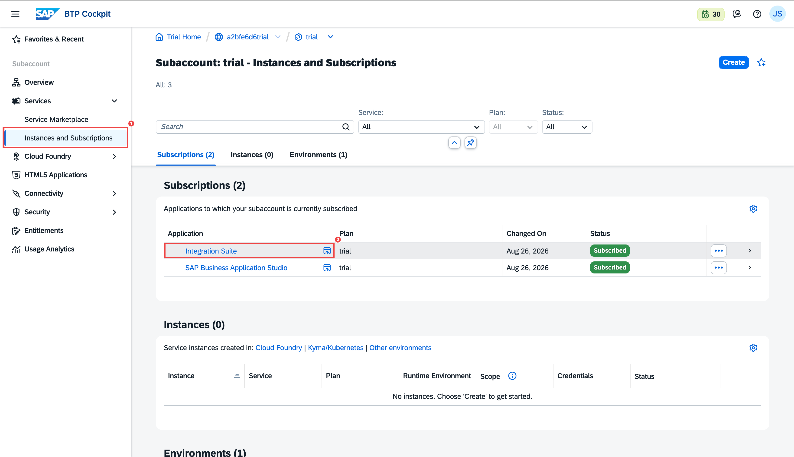

# 0. Prerequisites

This page assumes you have already completed the one-time SAP BTP setup. If you haven't, follow the links below before continuing. All other steps in this tutorial start from inside Integration Suite.

---

## If You Haven't Set Up BTP and Integration Suite Yet

Follow these official SAP tutorials in order:

1. [Create a Free Account on SAP BTP Trial](https://developers.sap.com/tutorials/hcp-create-trial-account/) — creates your BTP account and default `trial` subaccount
2. [Set Up SAP Integration Suite Trial](https://developers.sap.com/tutorials/cp-starter-isuite-onboard-subscribe) — subscribes Integration Suite, activates capabilities, assigns role collections

Once done, confirm:

- [ ] You can sign in to [https://cockpit.hanatrial.ondemand.com/](https://cockpit.hanatrial.ondemand.com/)
- [ ] Integration Suite is listed under **Services → Instances and Subscriptions** with status **Subscribed**

---

## Opening Integration Suite

This is your starting point for every step in this tutorial.

1. Sign in to the [BTP Cockpit](https://cockpit.hanatrial.ondemand.com/)
2. Open your **trial** subaccount
3. Go to **Services → Instances and Subscriptions**
4. Click **Integration Suite** to open it



> **Tip:** If navigation items like **Design** or **Monitor** are not visible, open Integration Suite in a new **incognito / private browsing window**.

---

## You Are Here

Once Integration Suite is open, you will work primarily in:

```
Integration Suite
└── Design
    └── Integrations and APIs   ← where packages and artifacts are created
└── Monitor
    └── Security Materials      ← where credentials are stored
```

The **Developer Hub** (for publishing and subscribing) is reached through the **Explore our ecosystem** icon in the Integration Suite header bar.

Next: [Build the Purchase Order MCP Server →](01-purchase-order-mcp.md)
