# 1. Prerequisites & Environment Setup

This section prepares the SAP BTP environment required for the MCP Server.

## 1.1 Create an SAP BTP Trial Account

SAP BTP Trial provides access to SAP Integration Suite and other BTP services for development and learning.

> **Need a step-by-step walkthrough?** Follow the official SAP tutorial:
> [Create a Free Account on SAP BTP Trial](https://developers.sap.com/tutorials/hcp-create-trial-account/)

1. Go to the SAP BTP Trial page.
2. Select **Try for Free**.
3. Sign in with your SAP Universal ID, or register for one.
4. Open the automatically created **trial** subaccount.

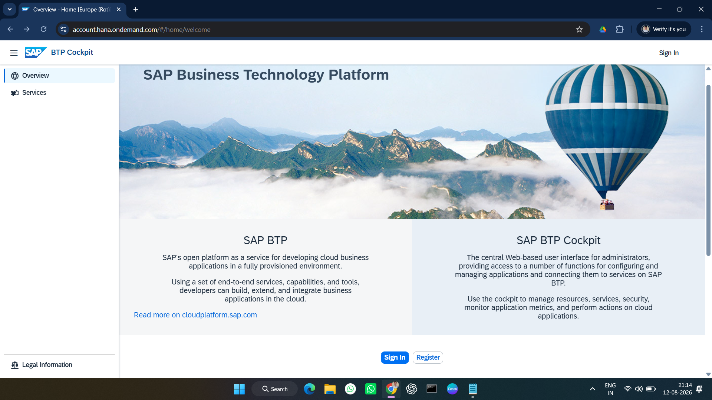

You should end up in the BTP Cockpit with a Global Account and a default `trial` subaccount.

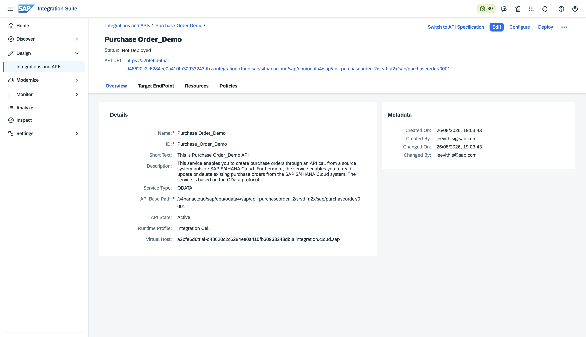

---

## 1.2 Subscribe to SAP Integration Suite

> **Need a step-by-step walkthrough?** Follow the official SAP tutorial:
> [Set Up SAP Integration Suite Trial](https://developers.sap.com/tutorials/cp-starter-isuite-onboard-subscribe)

1. In the BTP Cockpit, open:

   **Services → Service Marketplace**

2. Search for **Integration Suite**.
3. Open the Integration Suite tile.

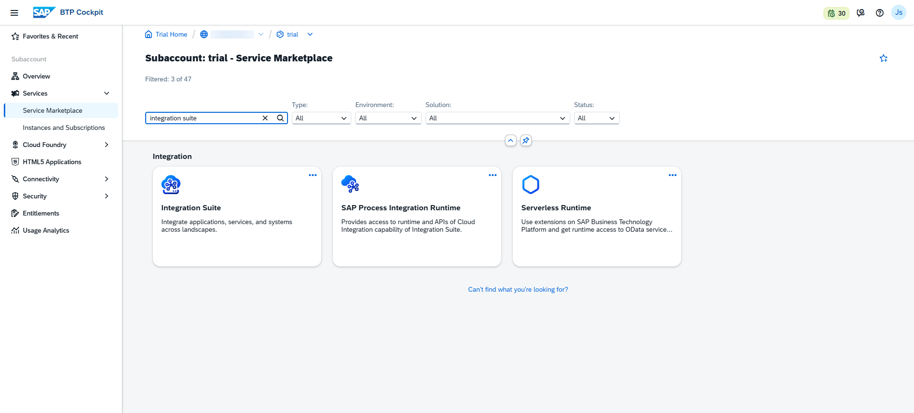

4. Select **Create**.
5. Configure:

   - **Service:** Integration Suite
   - **Plan:** `trial`

6. Create the subscription.
7. Go to:

   **Services → Instances and Subscriptions**

8. Confirm that Integration Suite shows **Subscribed**.

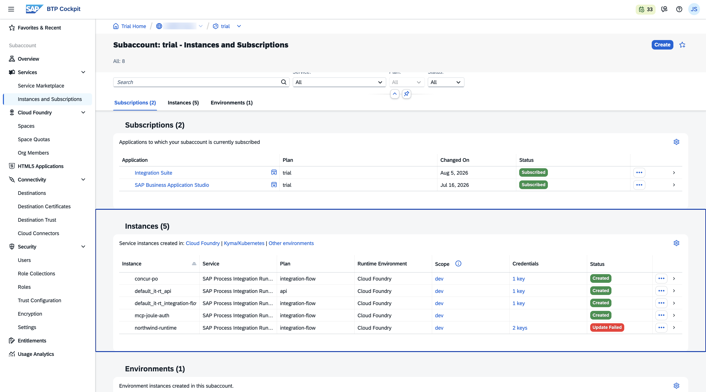

> Subscription provisioning can take a few minutes. Refresh until the status changes from `Processing` to `Subscribed`.

---

## 1.3 Assign the required role collections

Go to:

**Security → Users → your user → Role Collections**

Assign the following role collections for the trial walkthrough:

```text
APIManagement.SelfService.Administrator
APIPortal.Administrator
AuthGroup.API.Admin
AuthGroup.API.ApplicationDeveloper
AuthGroup.Content.Admin
AuthGroup.ContentAuthor
AuthGroup.SelfService.Admin
AuthGroup.Site.Admin
ESBMessaging.send
Integration_Provisioner
PI_Administrator
PI_Business_Expert
PI_Integration_Developer
Subaccount Administrator
```

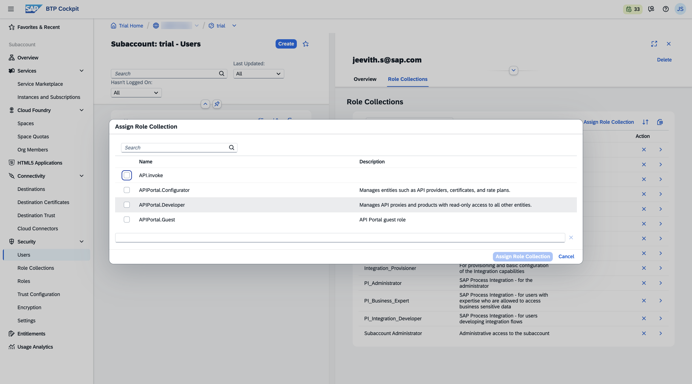

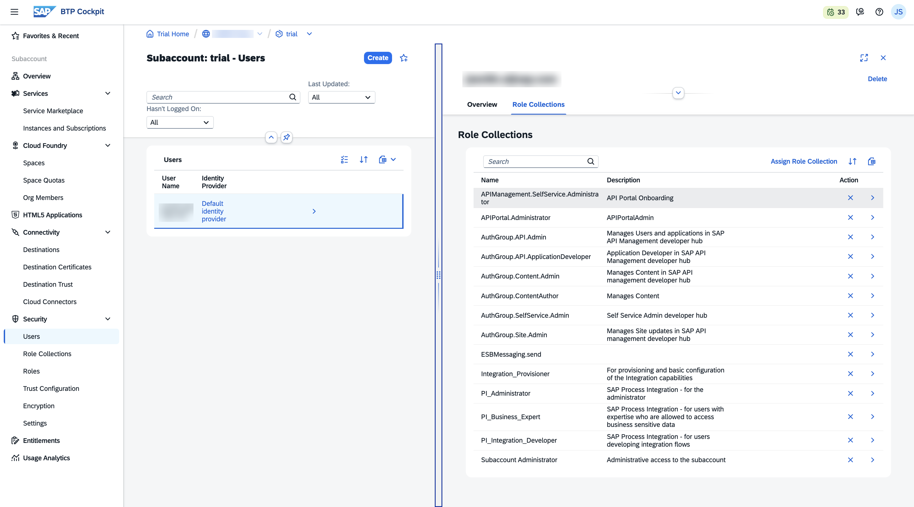

Save the changes and log out/in again so the role assignments take effect.

> **Production note:** The source tutorial explicitly recommends assigning only the minimum roles required in a production environment. The broad role set above is intended for the trial setup.

---

## 1.4 Create an OAuth2 service instance and service key

The MCP client needs credentials to authenticate against the MCP Server.

Navigate to:

**Services → Instances and Subscriptions → Instances → Create**

Configure:

| Property | Value |
|---|---|
| Service | `Process Integration Runtime` |
| Plan | `integration-flow` |
| Instance Name | Your chosen name, e.g. `mcp-auth` |

Create the instance.

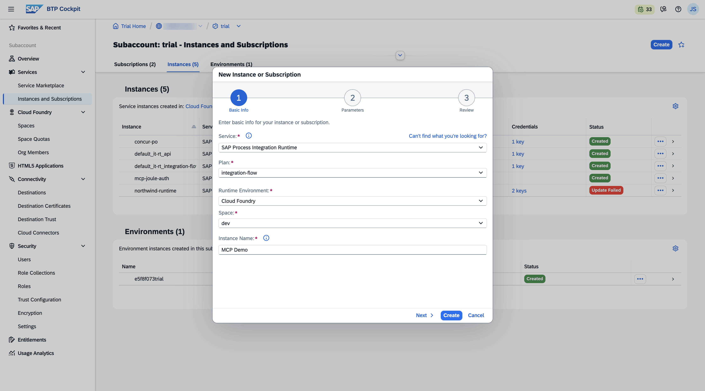

When the instance has status **Created**:

1. Open the instance.
2. Select **Create Service Key**.
3. Give the key a name such as `mcp-key`.

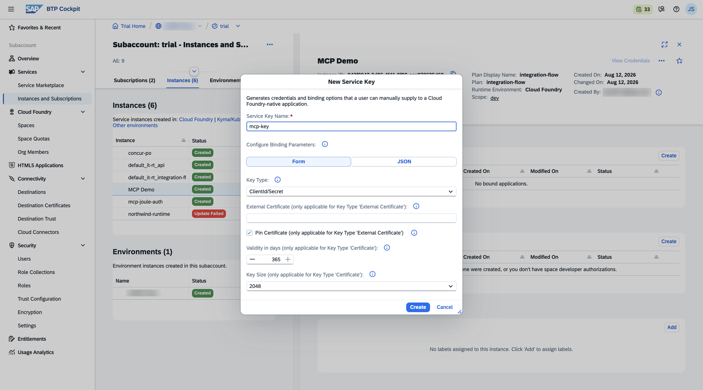

4. Open the key and record:

```text
clientid
clientsecret
tokenurl
url
```

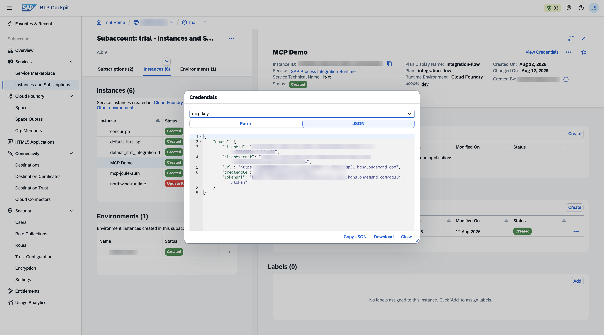

### Keep credentials out of Git

Never commit the service key or client secret to this repository.

---

## 1.5 Create the BTP destination

Navigate to:

**Connectivity → Destinations → Create Destination**

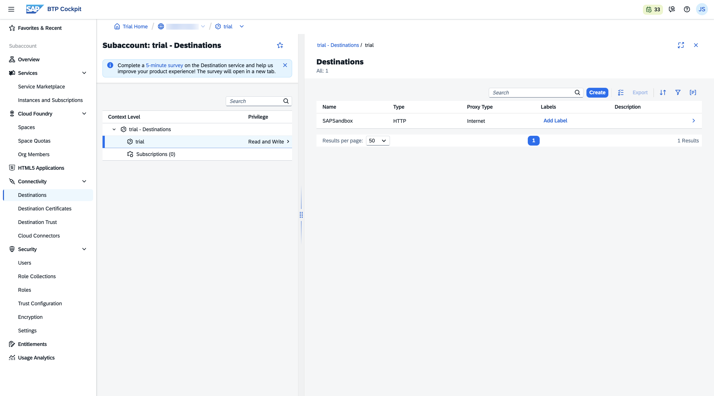

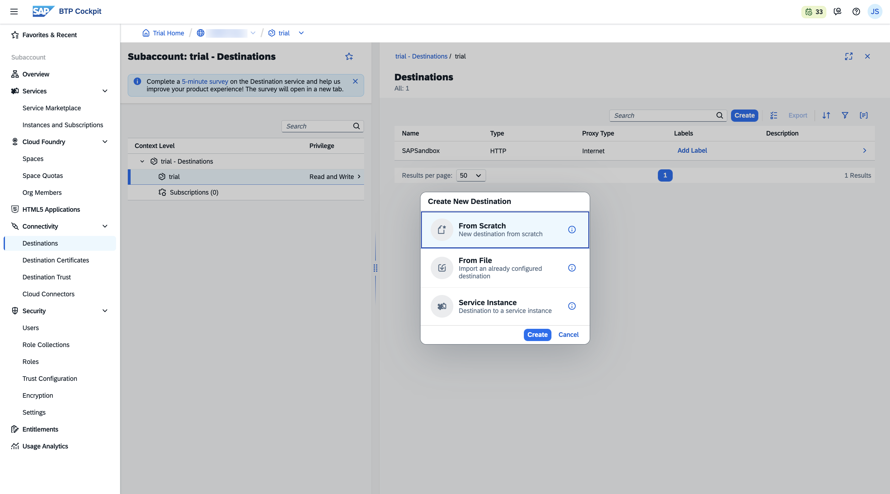

Example configuration from the tutorial:

| Property | Value |
|---|---|
| Name | Your destination name |
| Type | `HTTP` |
| URL | `https://sandbox.api.sap.com` |
| Proxy Type | `Internet` |
| Authentication | `NoAuthentication` or `OAuth2ClientCredentials` |

If the backend requires an API key, add:

```text
Property: URL.headers.APIKey
Value:    <your-api-key>
```

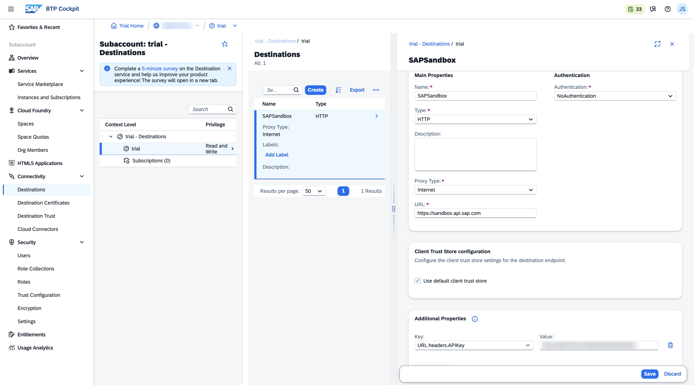

Save the destination and select **Check Connection**.

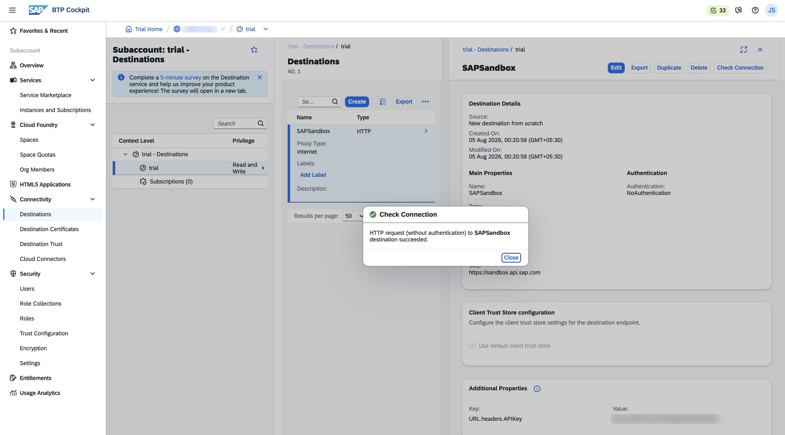

A successful connection should return a success message such as `200: OK` or indicate that the connection was established.

> The `URL.headers.APIKey` additional property causes the API key to be sent as an `APIKey` request header on outbound calls.

---

## Environment ready

At this point you should have:

- [ ] BTP Trial account
- [ ] Integration Suite subscribed
- [ ] Required trial roles assigned
- [ ] OAuth2 service instance created
- [ ] Service key created
- [ ] Backend destination configured
- [ ] Destination connection tested

Next: [Build the MCP Server →](02-build-mcp-server.md)
