# 2. Build the MCP Server

Now we create the Integration Suite artifacts that turn the backend API into an MCP endpoint.

## Architecture

```text
Integration Package
        │
        ├── API Artifact
        │      │
        │      └── HTTP Proxy → Backend API
        │
        └── MCP Server Artifact
               │
               └── exposes API capabilities as MCP tools
```

---

## 2.1 Create an Integration Package

Open SAP Integration Suite from the BTP subscription.

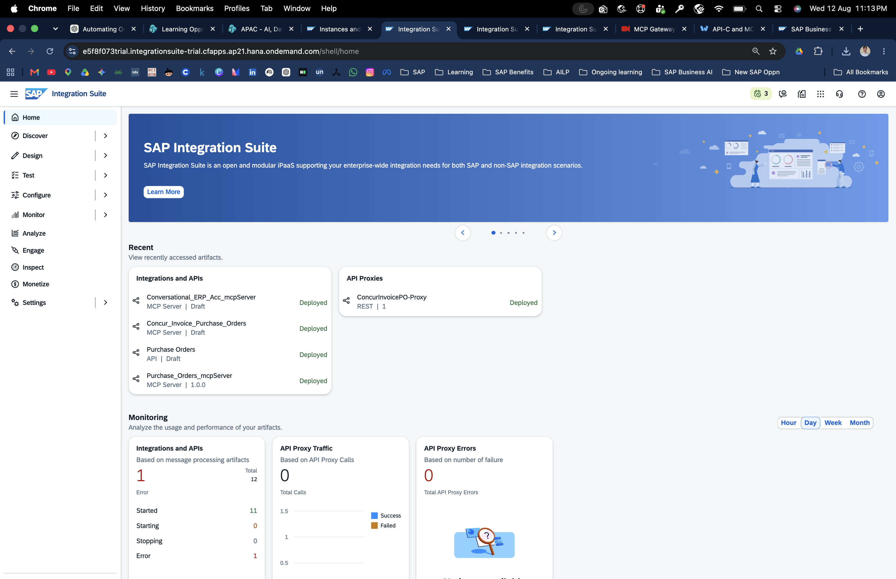

Navigate to:

**Design → Integrations and APIs**

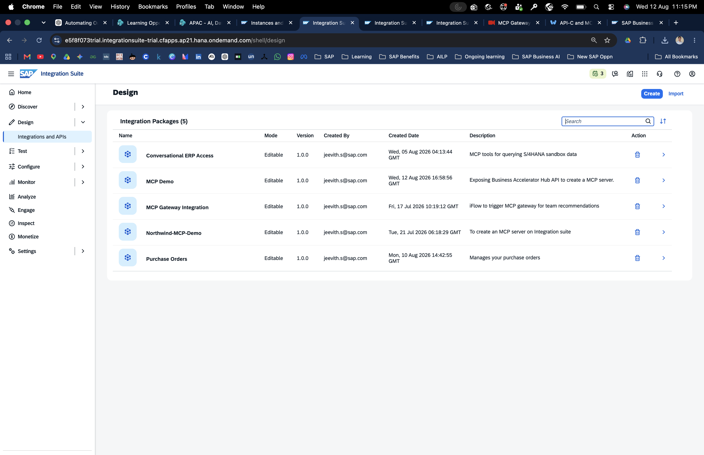

Create a new package.

Recommended fields:

| Property | Value |
|---|---|
| Name | Your package name |
| Technical Name | Auto-filled or your chosen technical name |
| Short Description | Brief description |
| Version | `1.0.0` |
| Vendor | Optional |

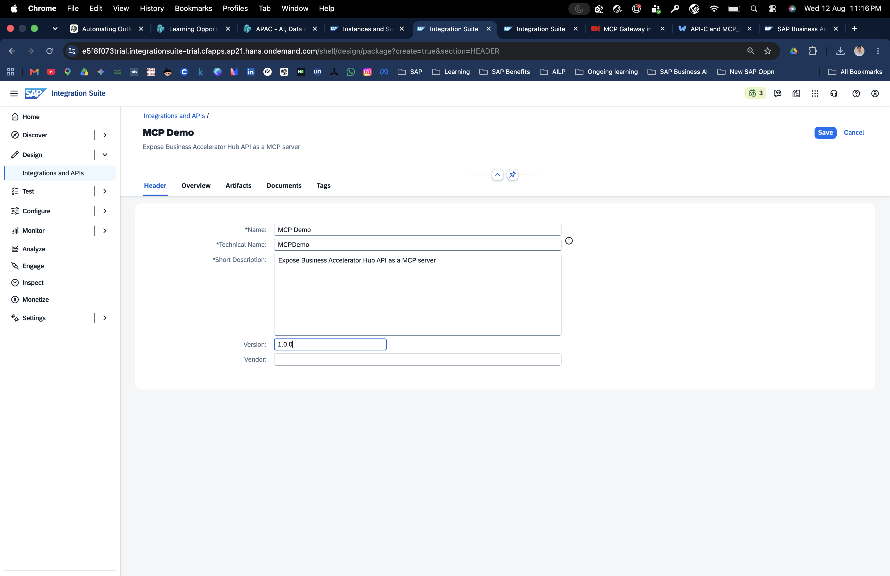

Save the package.

The new package initially contains no artifacts.

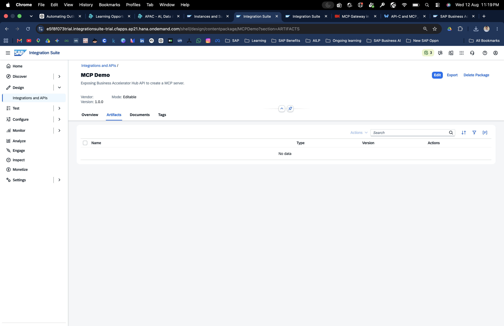

---

## 2.2 Create the API Artifact

Inside the package:

1. Select **Edit**.
2. Select **Add**.
3. Choose **API**.

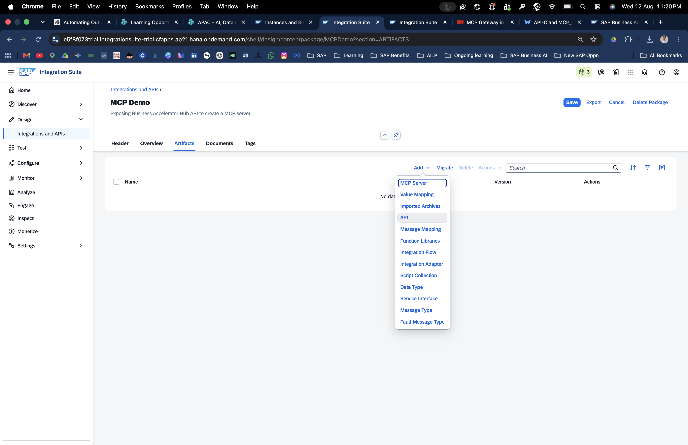

4. Select **Integration** as the runtime profile.

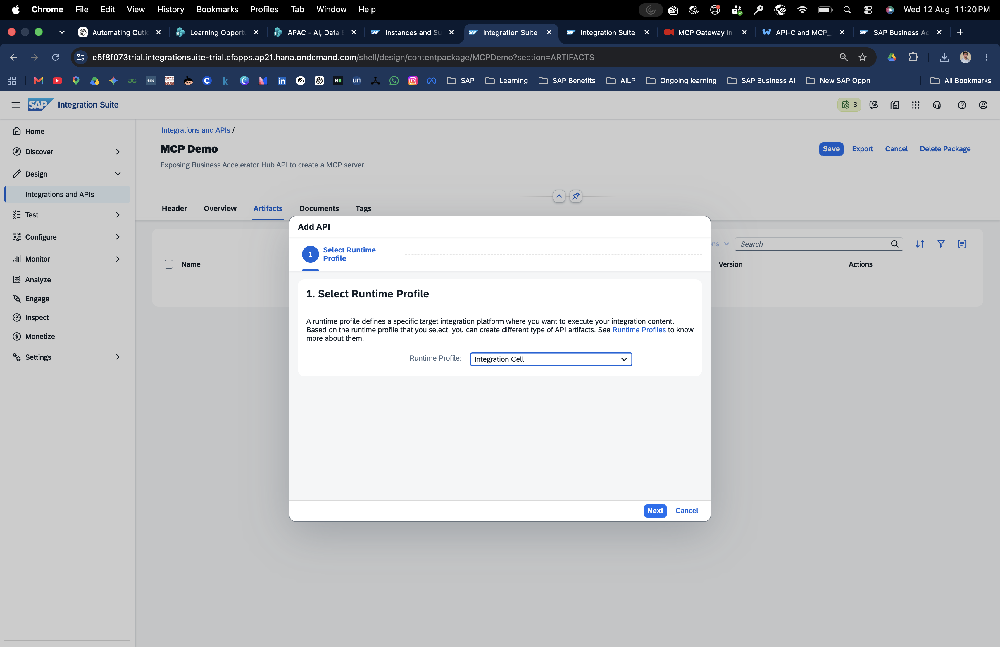

5. Select **URL or Specification**.

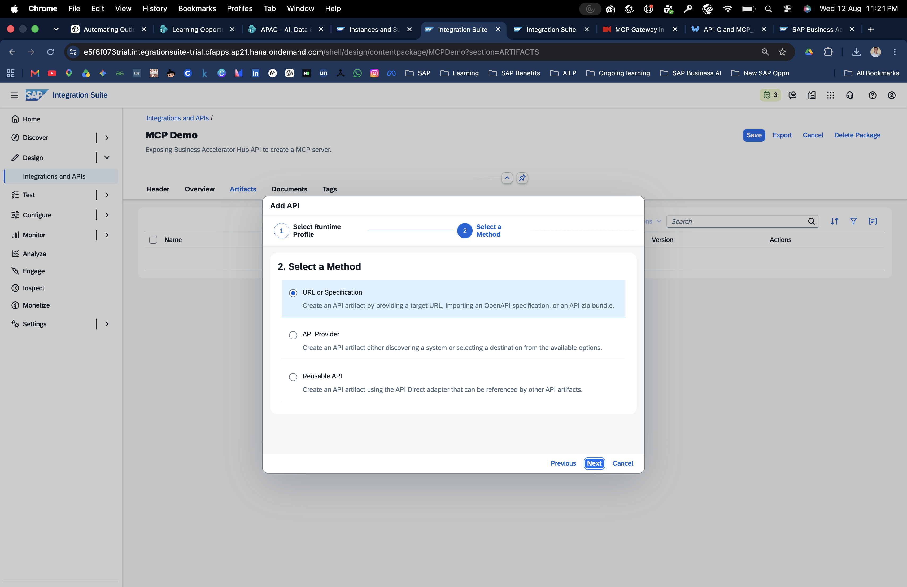

6. Upload the API specification obtained from SAP Business Accelerator Hub.
7. Complete the remaining API details.

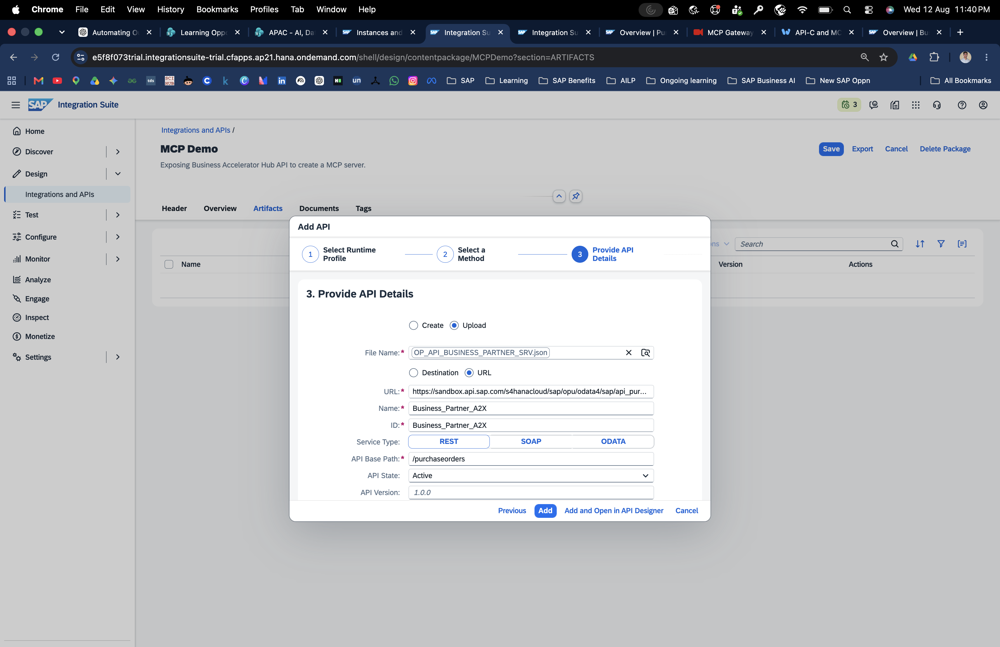

8. Open the **Policies** tab to review the default flow.
9. Deploy the API.

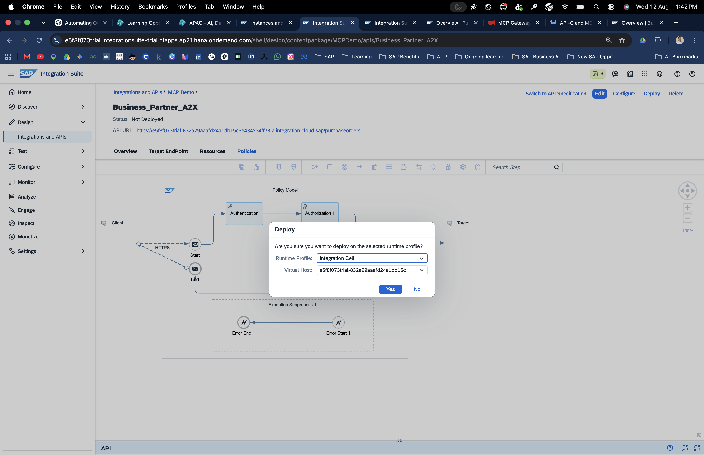

The default policy flow is:

```text
Client
  ↓
HTTPS
  ↓
Authentication
  ↓
Authorization
  ↓
Request Reply
  ↓
HTTP
  ↓
Target
```

After deployment, wait until:

```text
Status: Deployed
Runtime Status: STARTED
```

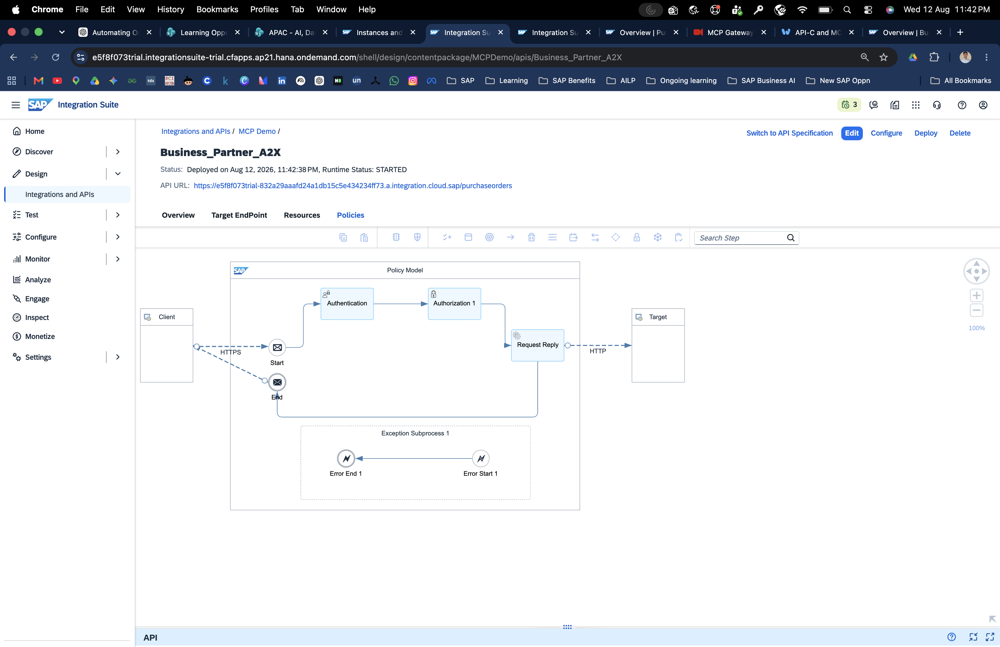

Record the API proxy URL.

### Why this matters

The API artifact is the HTTP-facing proxy layer. The MCP Server artifact uses this API layer as the underlying target that will be exposed as structured MCP tools.

---

## 2.3 Create the MCP Server Artifact

Inside the same package:

1. Select **Actions → Create**.
2. Choose **MCP Server**.

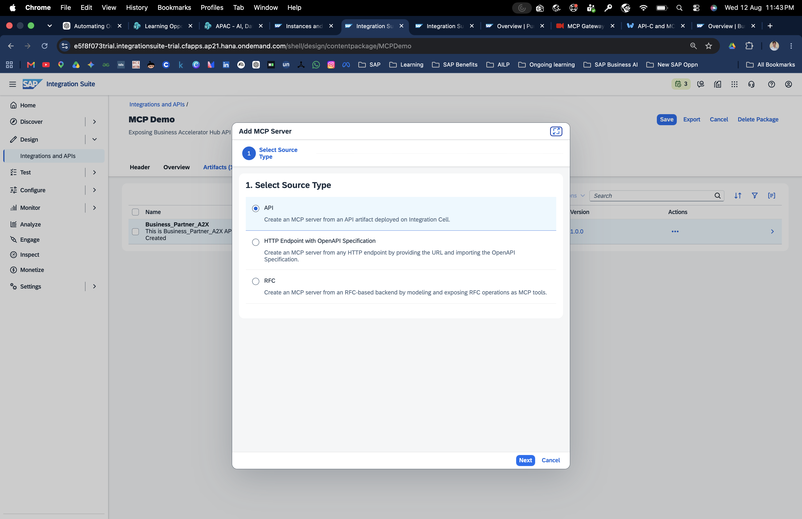

3. Select the deployed API artifact as the source.


4. Enter a name, for example:

```text
<PackageName>_mcpServer
```

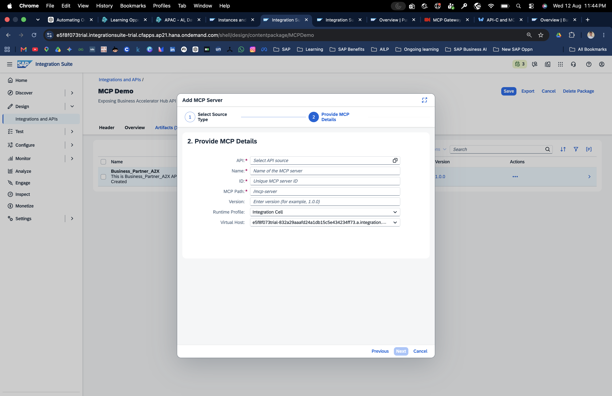

5. Fill in the details and create the artifact.

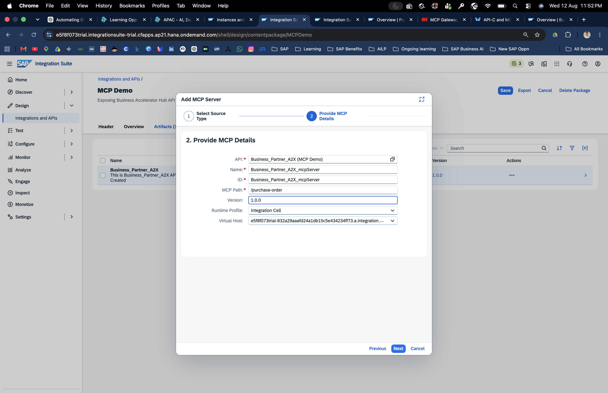

The MCP Server artifact contains:

- **Overview**
- **MCP Configuration**
- **Policies**

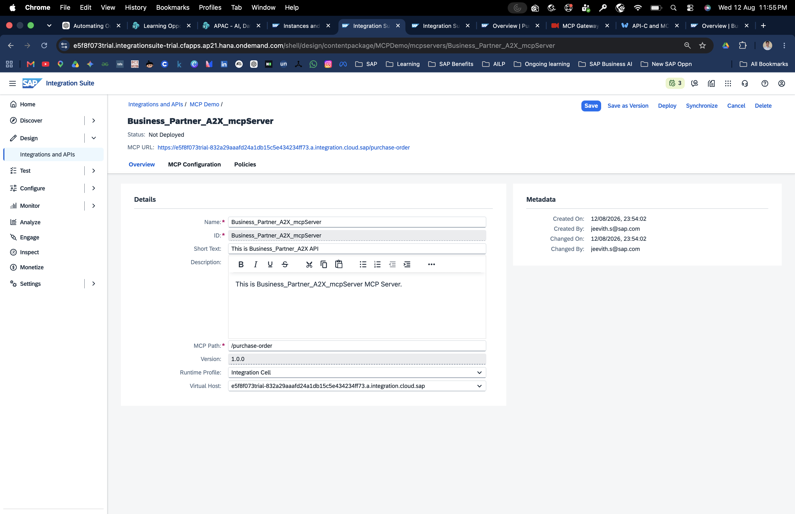

The artifact header displays the MCP endpoint.

It follows the pattern:

```text
https://<tenant>.integration.cloud.sap/<path>
```

The package should now contain two artifacts:

```text
<API name>          → API
<MCP Server name>   → MCP Server
```

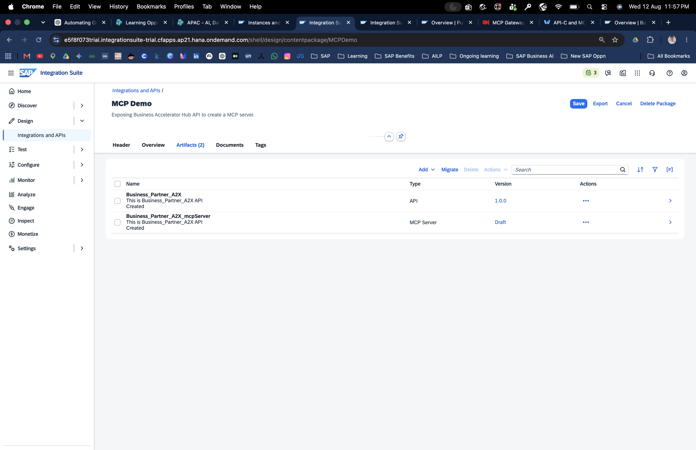

---

## What you have built

You now have the two key layers:

**API Artifact**

Provides the HTTP proxy and target connection.

**MCP Server Artifact**

Wraps the API capability and exposes it to MCP-compatible AI clients as structured tools.

Next: [Add governance and deploy →](03-govern-and-deploy.md)
