# 2. Build the API and MCP Server

This section creates the API artifact and MCP Server artifact inside SAP Integration Suite.

## 2.1 Create an Integration Package

1. In Integration Suite, open **Design → Integrations and APIs**.
2. Click **Create** to create a new Integration Package.

3. Fill in the package details:
   - **Name:** `Purchase Order` (or your chosen name)
   - **Technical Name:** auto-populated
   - **Short Description:** optional

4. Click **Save**.

---

## 2.2 Add an API Artifact

### Get the API specification from SAP Business Accelerator Hub

Open the [SAP Business Accelerator Hub](https://api.sap.com/api/CE_PURCHASEORDER_0001/overview) and locate the **Purchase Order** API.

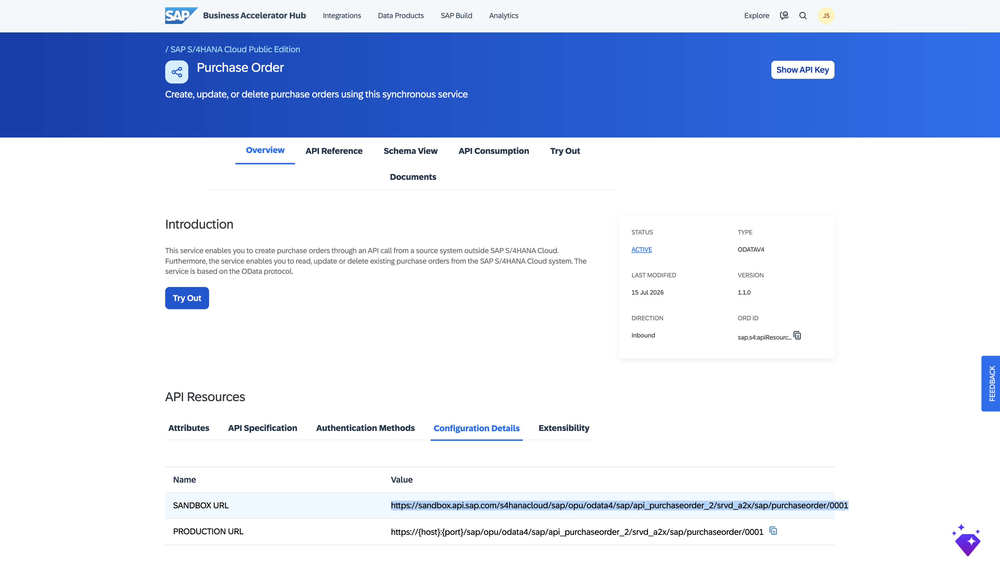

Note the **Sandbox URL** and download the **OpenAPI YAML file** from the **API Specification** section on the hub. You will use both in the next step.

### Add the API artifact

1. Inside your package, click **Edit** if not already in edit mode.
2. Click **Add → API**.

3. **Step 1 — Select Runtime Profile:** Choose **Integration Cell** and click **Next**.

4. **Step 2 — Select a Method:** Choose **URL or Specification** and click **Next**.

5. **Step 3 — Provide API Details:**
   - Upload the **OpenAPI YAML file** downloaded from the SAP Business Accelerator Hub.
   - **URL:** `https://sandbox.api.sap.com`
   - **Service Type:** `OData`
   - **API Base Path:** `/s4hanacloud/sap/opu/odata4/sap/api_purchaseorder_2/srvd_a2x/sap/purchaseorder/0001`
   - Click **Add**.

The API artifact is created with status **Not Deployed**.

---

## 2.3 Add a Content Modifier to Pass the API Key

The SAP sandbox requires an `APIKey` header. Add a **Content Modifier** step to inject it automatically.

1. Open the API artifact and go to the **Policies** tab.

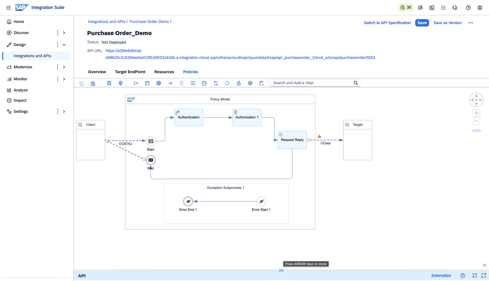

2. Click **Edit** to enter edit mode. Select the step after **Authorization 1** to add after it.

3. Click the **+** (Add Flow Step) and search for **Content Modifier**. Select it.

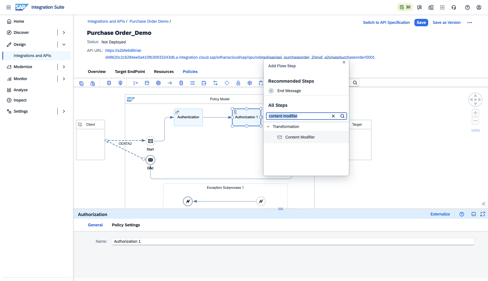

4. In the **Content Modifier** configuration, open the **Message Header** tab and click **Add**:

   | Field | Value |
   |---|---|
   | Action | `Create` |
   | Name | `APIKey` |
   | Source Type | `Constant` |
   | Source Value | *your API key from the SAP Business Accelerator Hub* |

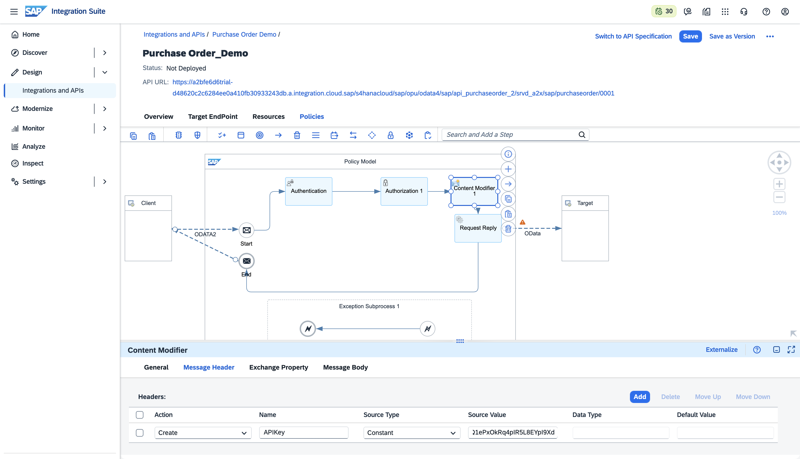

---

## 2.4 Deploy the API

1. Click **Deploy** in the toolbar.

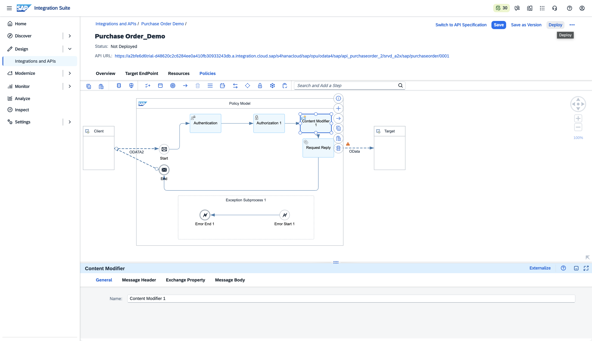

2. Confirm deployment to the **Integration Cell** runtime.

> **Note:** If a warning badge appears on a step, this is a design-time constraint and does not block runtime. You can safely proceed with deployment.

3. Wait until the Runtime Status shows **STARTED**.

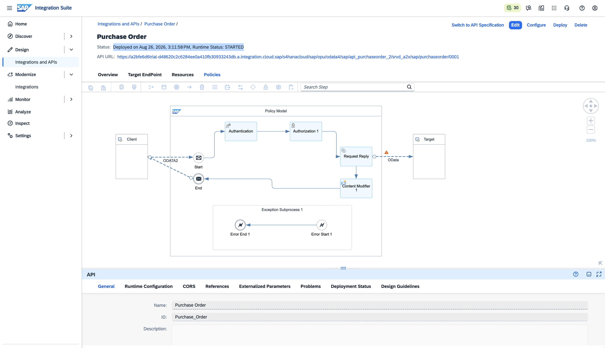

---

## 2.5 Add an MCP Server Artifact

1. Inside your package, click **Edit** then **Add → MCP Server**.

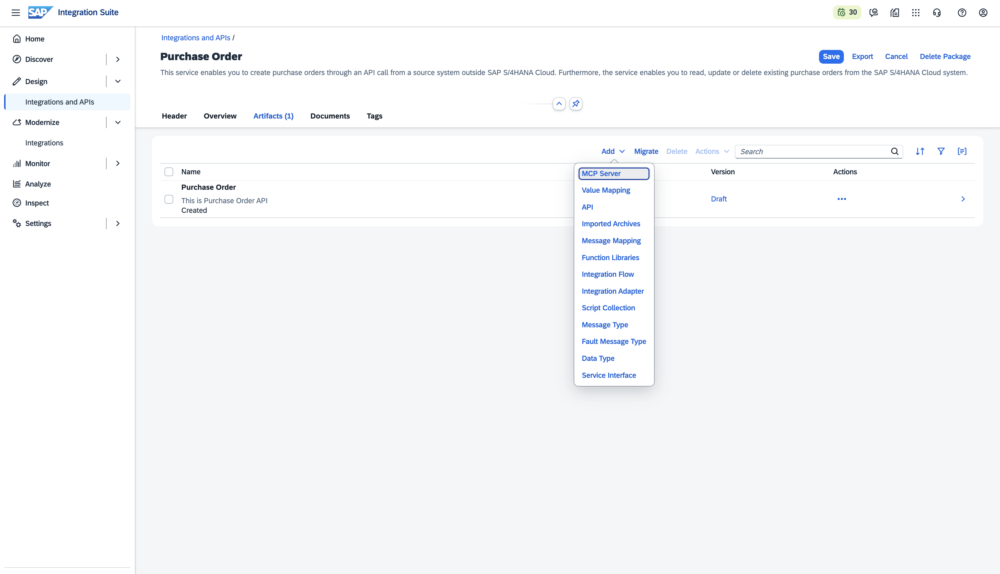

2. **Step 1 — Select Source Type:** Choose **API** and click **Next**.

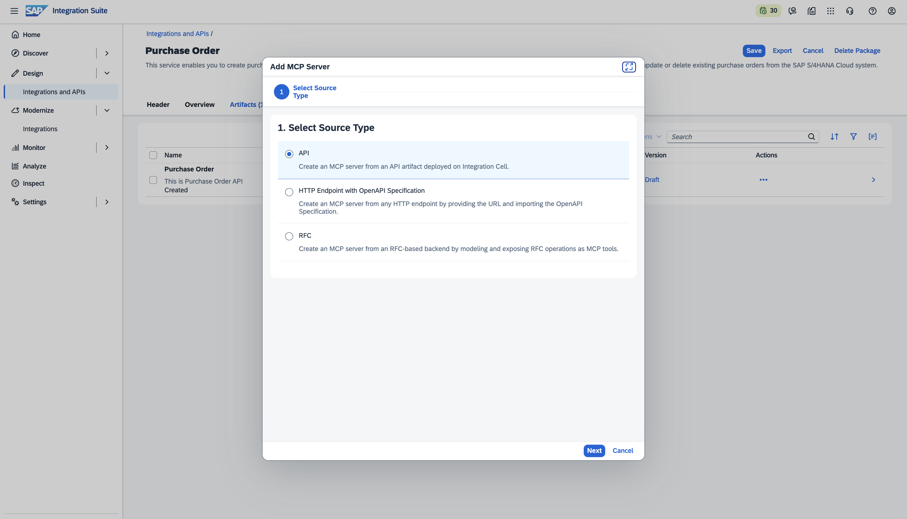

3. **Step 2 — Provide MCP Details:**
   - Click **Select an API** and choose your deployed Purchase Order API.

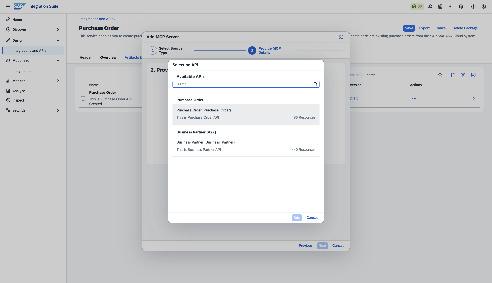

   - Fill in values of your choice:

   | Field | Example |
   |---|---|
   | Name | `Purchase_Order_mcpServer` |
   | MCP Path | `/mcp` |
   | Version | `1.0.0` |
   | Runtime Profile | `Integration Cell` |

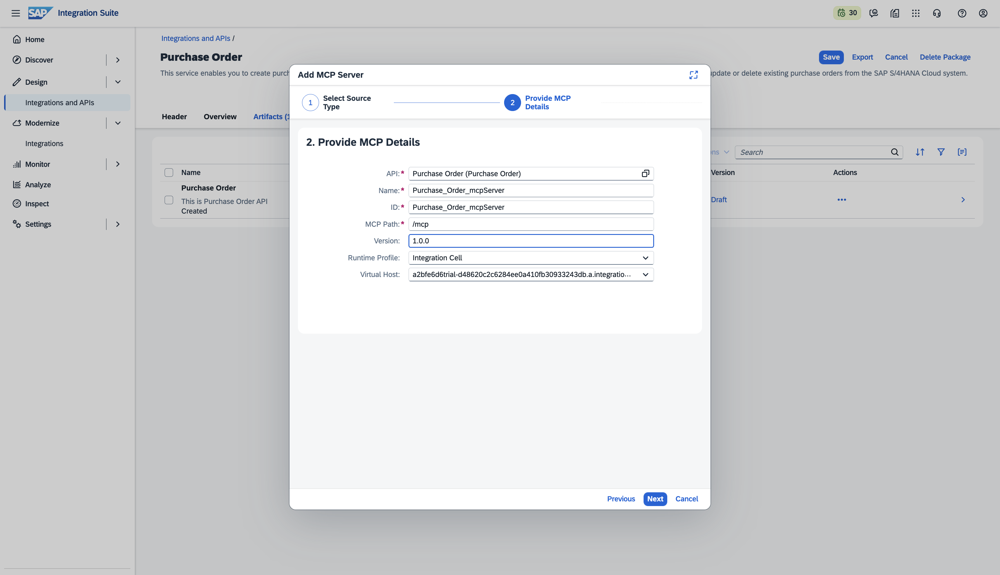

4. **Step 3 — Create Tools:** Select the API resources to expose as MCP tools. Choose the operations your AI client will need, then click **Add**.

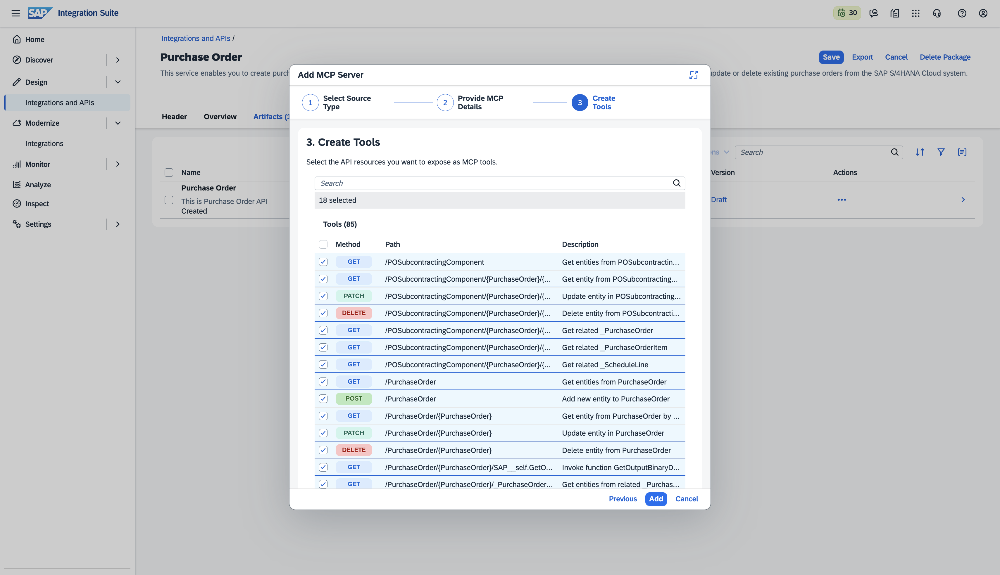

---

## 2.6 Deploy the MCP Server

1. Open the new MCP Server artifact. Review the **Overview** tab to confirm the MCP URL and runtime settings.

2. Go to the **Policies** tab.

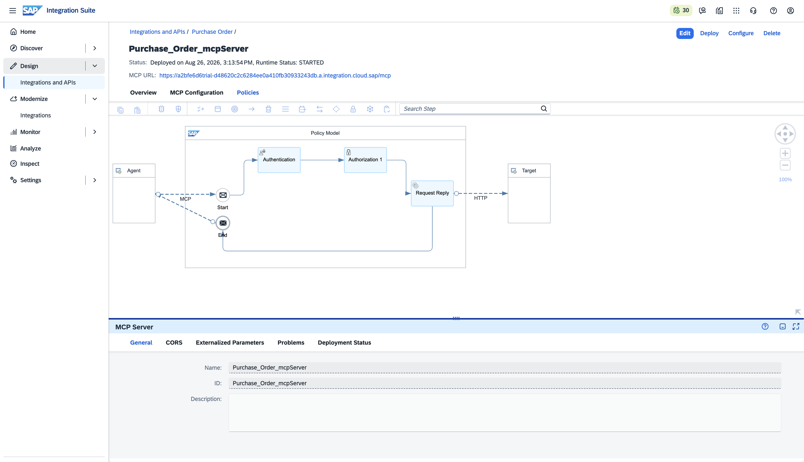

3. Click **Deploy**.

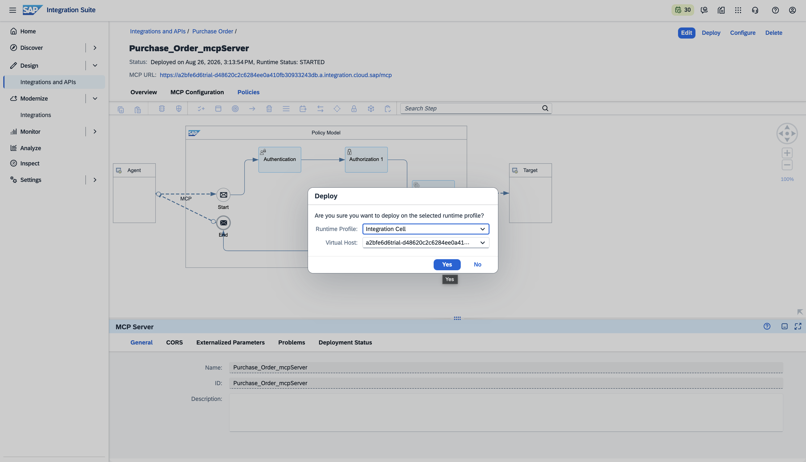

4. Wait until Runtime Status shows **STARTED**.

---

## MCP Server ready

- [ ] Integration Package created
- [ ] API artifact created from BAH specification
- [ ] Content Modifier configured with APIKey header
- [ ] API artifact deployed (STARTED)
- [ ] MCP Server artifact created with tools selected
- [ ] MCP Server deployed (STARTED)

Next: [Publish to Developer Hub →](03-govern-and-deploy.md)
