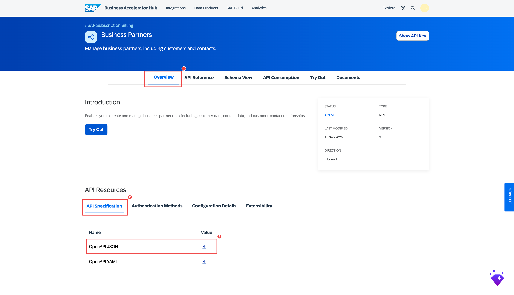

# 2. Business Partner MCP Server

The process for the Business Partner MCP Server is **identical to Section 1** (Purchase Order). This page provides only the Business Partner-specific values. Follow [Section 1](01-purchase-order-mcp.md) for all steps — substituting the values below where indicated.

---

## Business Partner-Specific Values

### API Specification

Download the OpenAPI spec from the [SAP Business Accelerator Hub — Business Partner API](https://api.sap.com/api/API_BUSINESS_PARTNER/overview).

Download the OpenAPI spec from the **API Specification** section as **OpenAPI JSON** (same as the Purchase Order server — the `.json` form imports reliably into SAP IS).

### API Artifact Settings (Part C of Section 1)

| Field | Value |
|---|---|
| Upload file | The Business Partner **OpenAPI JSON** file downloaded from BAH |
| URL | `https://sandbox.api.sap.com/s4hanacloud/sap/opu/odata/sap/API_BUSINESS_PARTNER` |
| Service Type | `REST` |
| API Base Path | `/API_BUSINESS_PARTNER` |

!!! note "Business Partner differs from Purchase Order here"
    The Business Partner API uses **Service Type `REST`** (not `OData`), and both the **URL** and **API Base Path** differ from Section 1. Everything else — Content Modifier, Trust Upstream MCP Authorization, the `uaa.resource` scope on the MCP Server, deploy, publish, subscribe — is identical.

### MCP Server Settings (Part F of Section 1)

| Field | Example value |
|---|---|
| Name | `BusinessPartner_MCP` |
| MCP Path | `/businesspartnermcp` |
| Version | `1.0.0` |
| Runtime Profile | `Integration Cell` |

### Recommended Tools to Select (Part F, Step 3)

Select these **GET** operations when choosing tools in the MCP Server wizard:

| Tool | What the AI can do |
|---|---|
| `get_customers` | List all customers matching search criteria |
| `get_customers_customerNumber` | Get a specific customer by their number |
| `get_contacts` | Search contacts across the business partner master |

!!! warning "Read-only backend"
    Like Purchase Order, the Business Partner sandbox does **not** allow write operations. Do **not** select `post_customers`, delete, or other write tools — they would fail at call time.

---

## Steps Reference

Follow all parts of [Section 1](01-purchase-order-mcp.md) with the values above substituted:

- **Parts A–B** — Use the same Integration Package you created in Section 1
- **Part C** — Upload the Business Partner OpenAPI JSON file; use the URL, Service Type (`REST`), and base path above; then enable **Trust Upstream MCP Authorization**
- **Part D** — Add the Content Modifier with the same `APIKey` header (same BAH API key)
- **Parts E–J** — Identical process; use `BusinessPartner_MCP` as the artifact name, select **GET** tools only, and add the `uaa.resource` scope on the MCP Server's Authorization

---

## Checklist

- [ ] Business Partner OpenAPI spec downloaded from SAP BAH
- [ ] API artifact created with Business Partner URL and base path
- [ ] MCP Server artifact created with Business Partner tools selected
- [ ] MCP Server deployed (STARTED)
- [ ] Product published and agent subscription created in Developer Hub
- [ ] Credentials (Token URL, Key, Secret) saved

Next: [Spotify MCP Server →](03-spotify-mcp.md)
