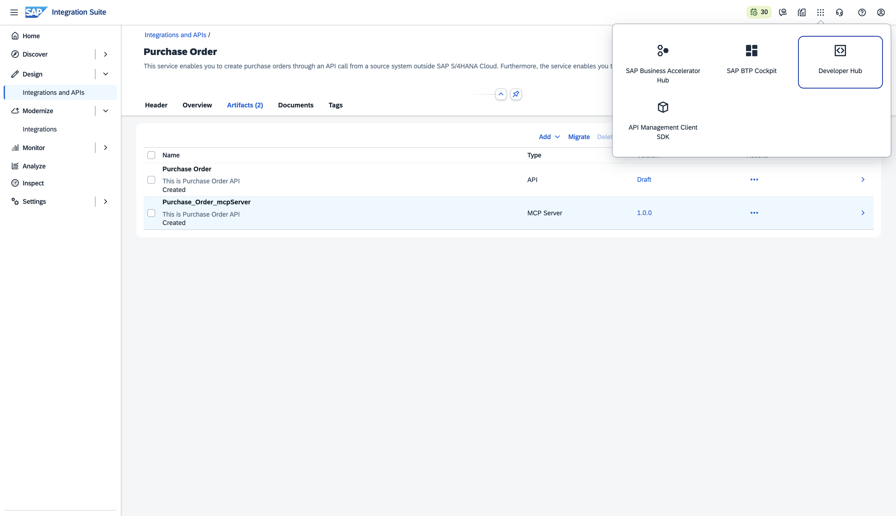
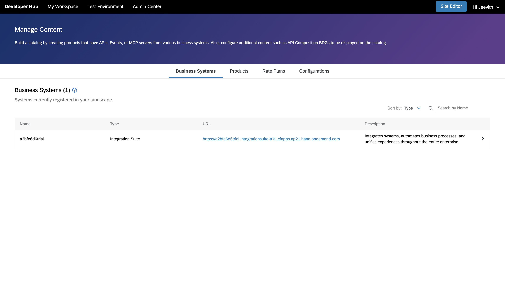
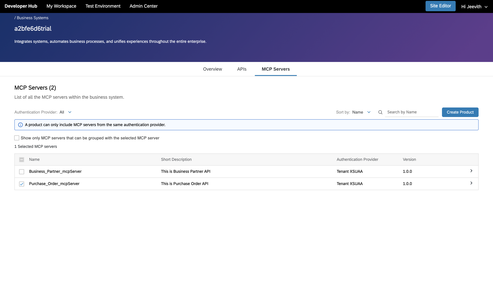
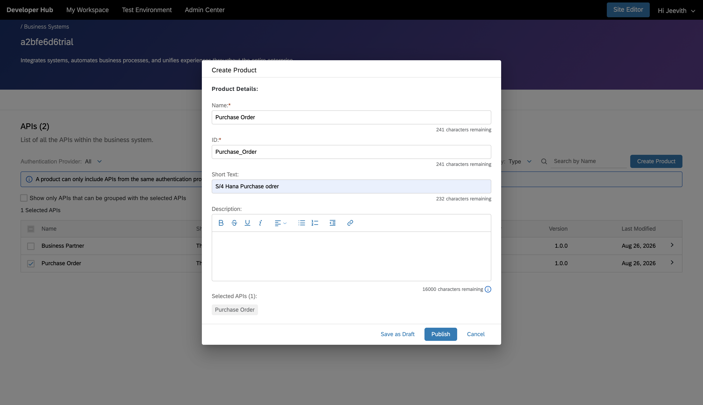
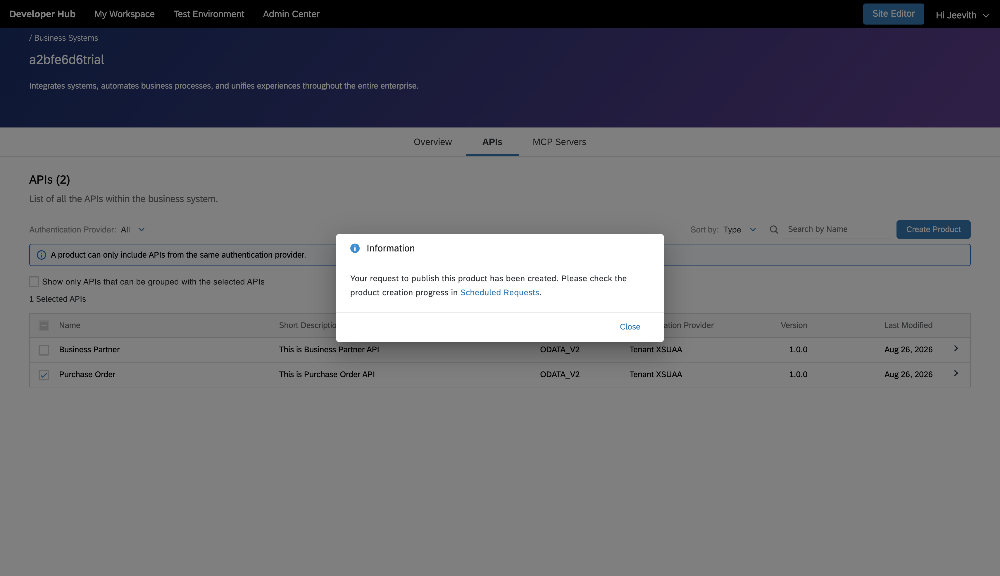

# 3. Publish to Developer Hub

The SAP API Management Developer Hub is the catalog where AI agents discover and subscribe to your MCP Server.

## 3.1 Navigate to Developer Hub

1. In SAP Integration Suite, click the **Explore our ecosystem** icon in the header bar (fourth icon from the right).
2. Click **Developer Hub**.

---

## 3.2 Create a Product from Your MCP Server

1. In the Developer Hub, go to **Admin Center → Manage Content**.
2. Click the **Business Systems** tab. Your Integration Suite subaccount appears as a registered business system.

3. Click on your business system to open it.
4. Go to the **MCP Servers** tab. Your deployed MCP Server is listed here. Select it by checking the box.

5. Click **Create Product** and enter a name, ID, and description of your choice.

6. Click **Publish**. A confirmation dialog appears.

7. Navigate to **Scheduled Requests** to monitor the publish status. Wait until the status changes to **Success**.

---

## Developer Hub ready

- [ ] Navigated to Developer Hub via Explore our ecosystem
- [ ] MCP Server found in Business System
- [ ] Product created in Developer Hub
- [ ] Publish status shows Success in Scheduled Requests

Next: [Subscribe via Developer Hub →](04-connect-ai-clients.md)
