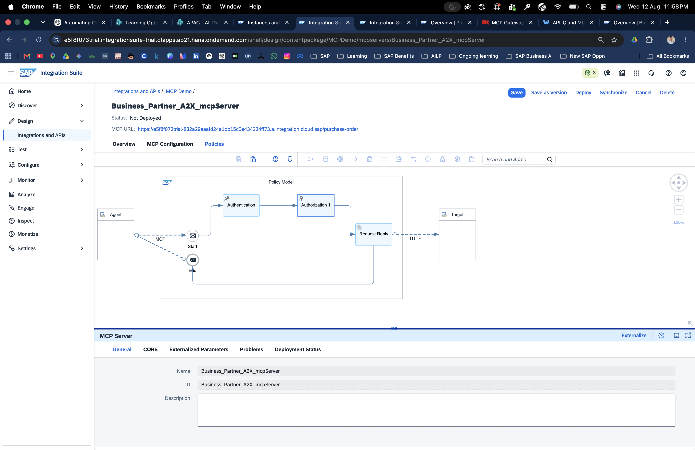
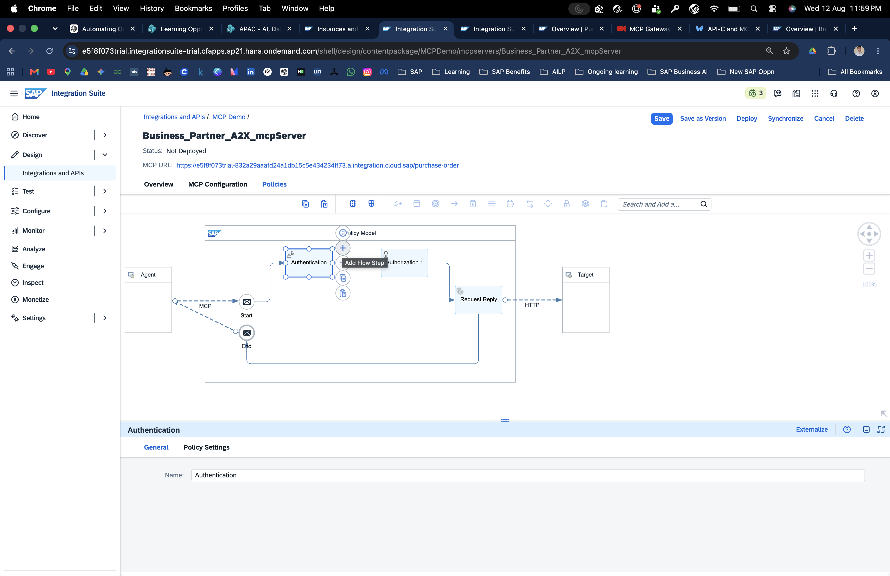
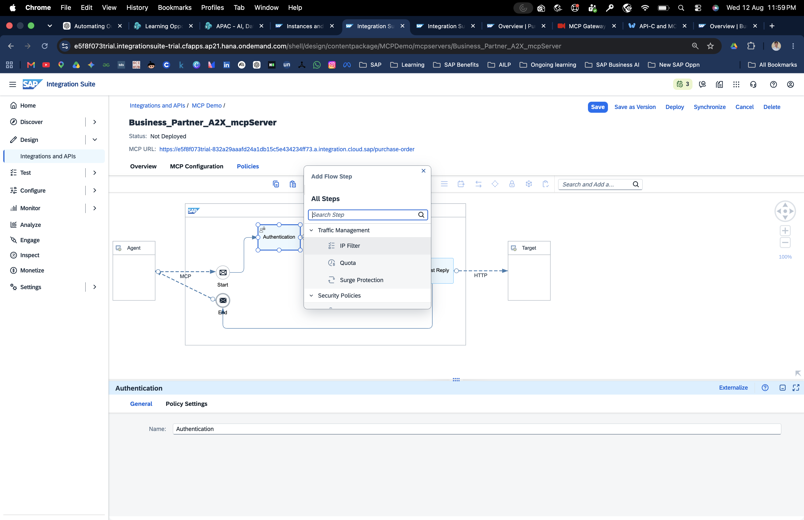
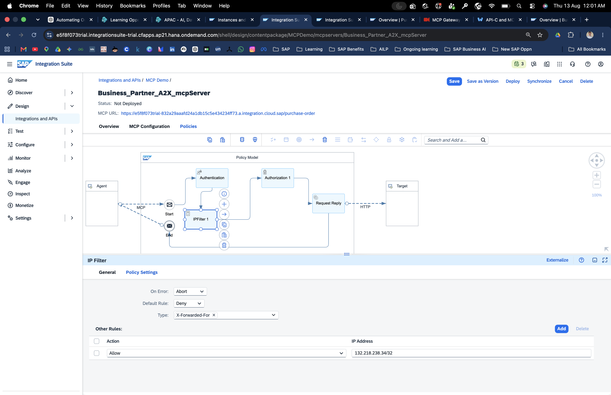
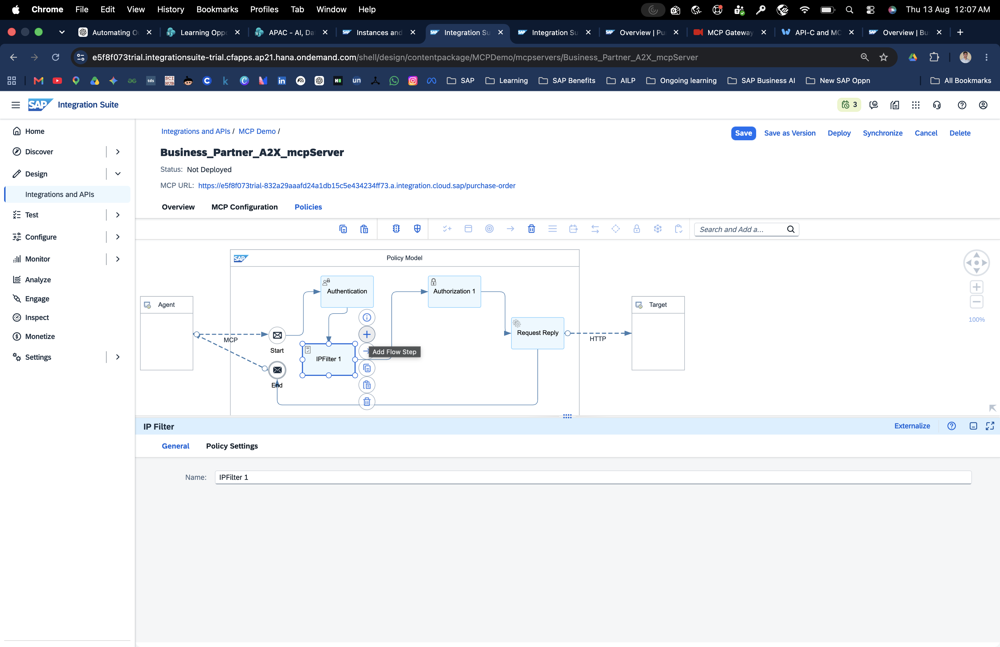
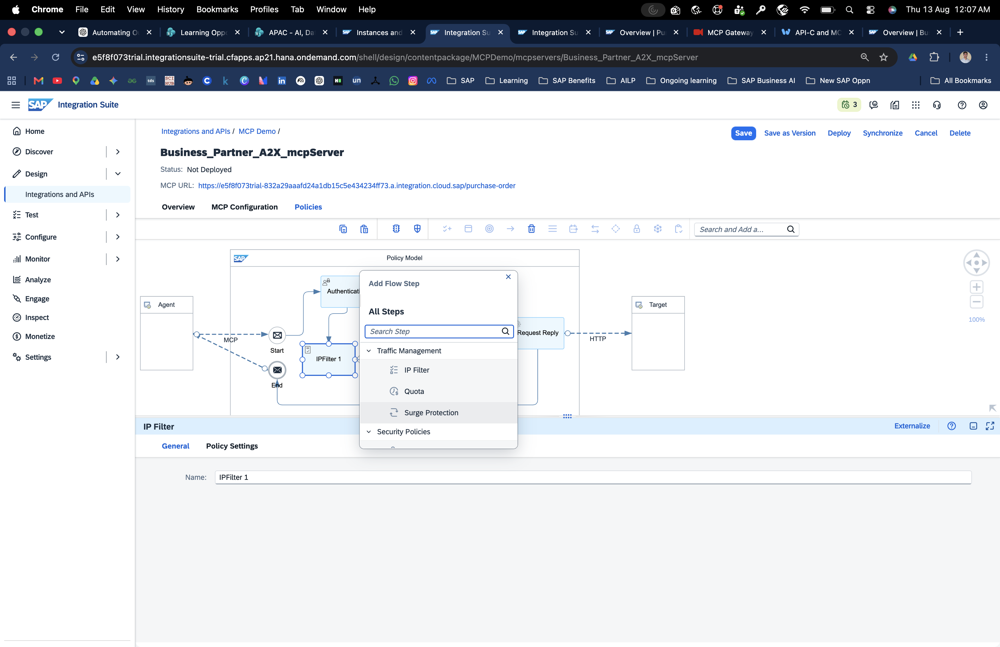
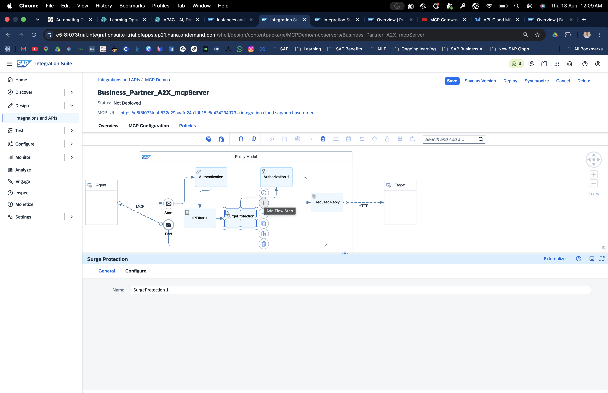
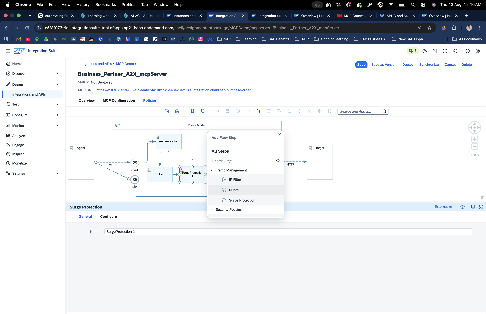
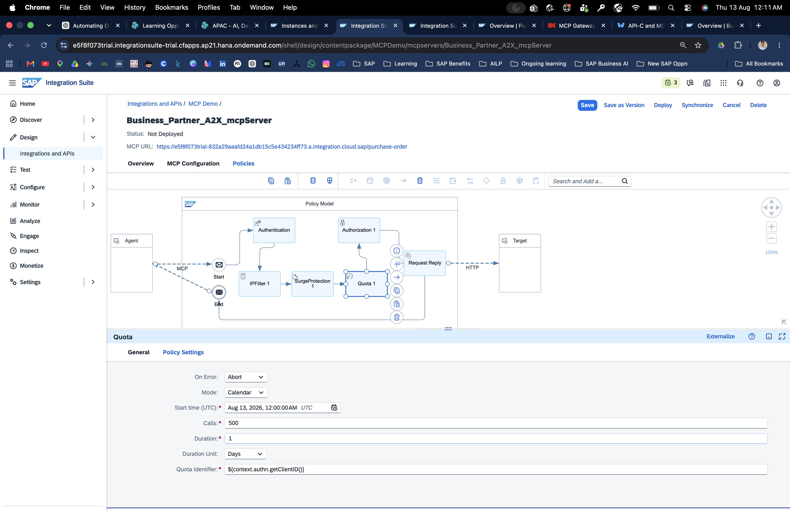
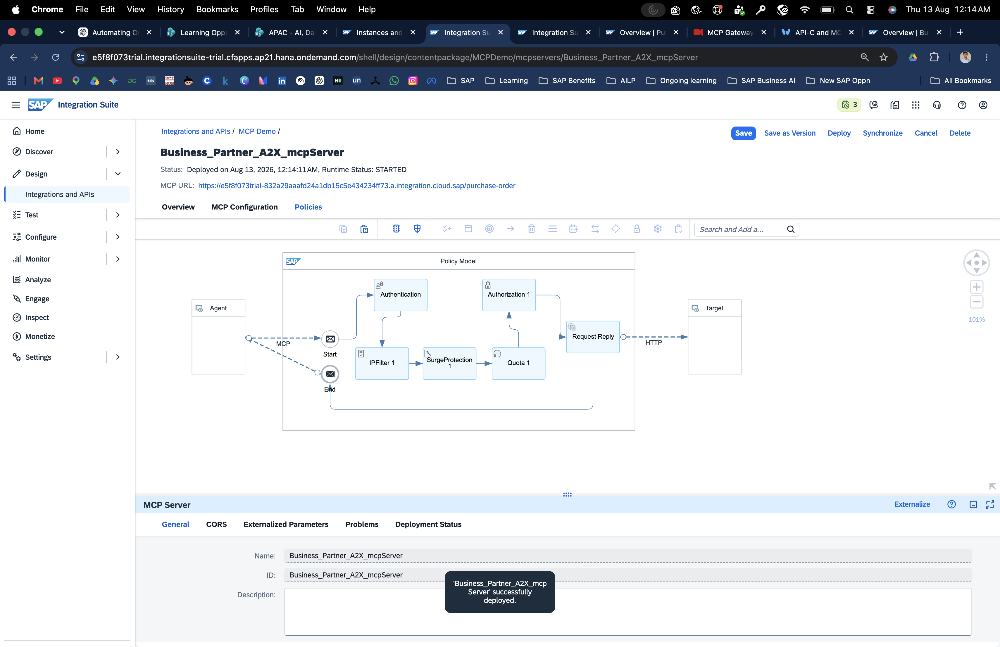

# 3. Govern & Deploy the MCP Server

The MCP Server is now created. Before exposing it to an AI client, configure governance policies and deploy it.

## 3.1 Open the Policies tab

Open the MCP Server artifact and select **Policies**.



The default flow is:

```text
Agent
  ↓
MCP
  ↓
Authentication
  ↓
Authorization
  ↓
Request Reply
```

Authentication is pre-configured by the platform and is the first step.

---

## 3.2 Add an IP Filter

Select **Add Flow Step** between Authentication and Authorization.



Choose **IP Filter** from the Traffic Management section.



Place it after **Authentication** and before **Surge Protection**.

Configure:

| Setting | Value |
|---|---|
| Default Rule | `Deny` |
| Type | `X-Forwarded-For` |
| Additional rule | `Allow` |
| IP Address | `<your-ip>/32` |

A single IP should use CIDR notation with `/32`.



Save the policy.



> Be careful with IP filtering if your client IP changes. A rule that allows only one source IP can prevent your AI client from reaching the server after a network change.

---

## 3.3 Add Surge Protection

Select:

**Add Flow Step → Traffic Management → Surge Protection**

Place it after the IP Filter.



Configure:

```text
Calls:         20
Duration:      1
Duration Unit: Seconds
```

Save.



---

## 3.4 Add a Quota

Select:

**Add Flow Step → Traffic Management → Quota**

Place it after Surge Protection.



Configure:

```text
Allow: 50
Per:   Day
```

Save.



---

## 3.5 Verify the final policy flow

The tutorial's final flow is:

```text
Authentication
      ↓
IPFilter
      ↓
SurgeProtection
      ↓
Quota
      ↓
Authorization
      ↓
Request Reply
```

Before deployment:

- [ ] No policy step shows a red validation badge
- [ ] IP Filter is configured
- [ ] Surge Protection is configured
- [ ] Quota is configured
- [ ] Changes are saved

---

## 3.6 Deploy the MCP Server

In the MCP Server artifact:

1. Click **Save**.
2. Verify that there are no red validation badges.
3. Click **Deploy**.
4. Wait for:

```text
Status: Deployed
Runtime Status: STARTED
```



The MCP URL shown at the top of the artifact is now active.

Copy the MCP URL. You'll use it in the AI client configuration.

### If deployment fails

Start with the policy flow.

A red validation badge indicates a configuration problem. Resolve the policy error, save again, and redeploy.

---

## Deployment complete

You should now have:

```text
MCP URL
OAuth2 token URL
OAuth2 client ID
OAuth2 client secret
```

Keep the credentials private.

Next: [Connect an AI client →](04-connect-ai-clients.md)
