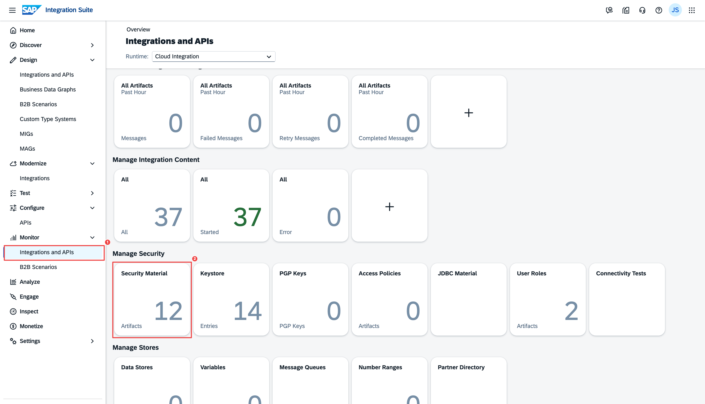
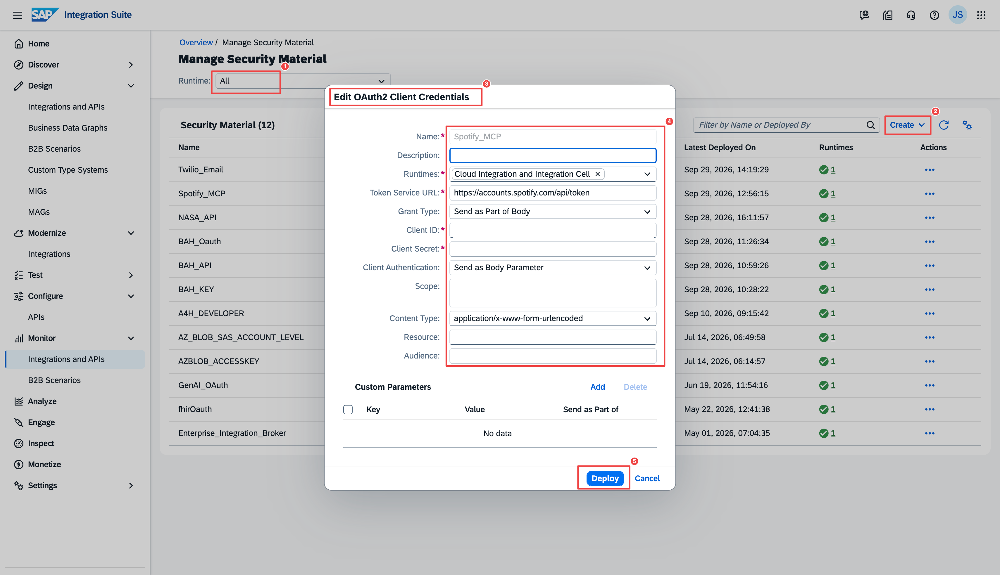
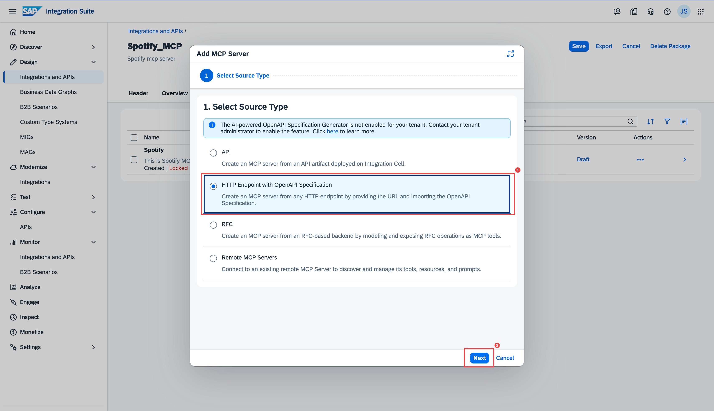
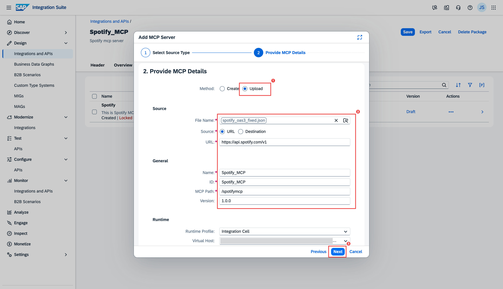
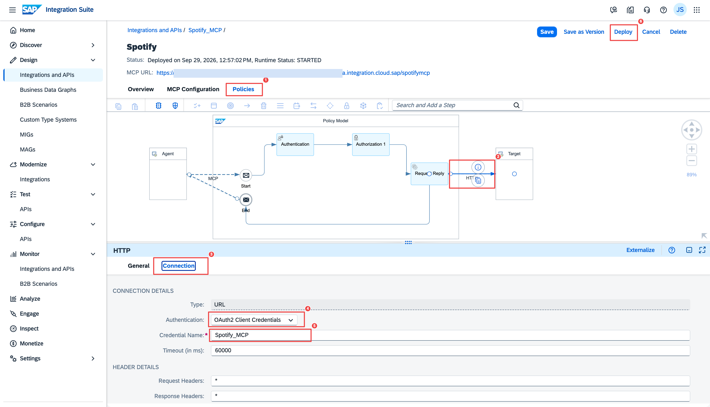

# 3. Spotify MCP Server

The Spotify MCP Server introduces a **different pattern** from Sections 1 and 2. Because Spotify authenticates with **OAuth2 Client Credentials** rather than a header API key, there is no API artifact — you upload an OpenAPI spec directly to the MCP Server artifact, create a **Security Material** to hold the OAuth2 credentials, and manually configure the **Policies** tab.

**What you will build:**

```
AI Client  ──MCP──▶  SAP IS MCP Server  ──OAuth2 CC──▶  Spotify Web API
```

!!! info "Why this pattern is different"
    Sections 1 and 2 used BAH APIs that authenticate with a static **API key sent as a request header** — so we wrapped each one in an **API artifact** whose Content Modifier injects that key. Spotify is different: it uses the **OAuth2 Client Credentials** flow, where you exchange a client ID + secret for a short-lived access token on every call. For that flow, no API artifact is needed — an **MCP Server artifact plus a Security Material** (which stores the credentials and fetches the token for you) is enough. This is the pattern for any backend that authenticates with OAuth2 client credentials.

---

## What You Need

- A [Spotify account](https://developer.spotify.com/) with access to the Developer Dashboard
- A Spotify App with OAuth2 Client Credentials
    - Go to [developer.spotify.com/dashboard](https://developer.spotify.com/dashboard) → **Create app**
    - Note your **Client ID** and **Client Secret**

!!! warning "Creating a Spotify app requires a paid (Premium) account"
    Spotify currently requires a **Spotify Premium** subscription to create a Developer app. If you don't have Premium, **skip this section and continue to [Twilio Email MCP →](04-twilio-mcp.md)**. The servers are independent — the AI agent in Section 5 works with whichever servers you have deployed, so you lose nothing by skipping Spotify.

---

## Step 1 — Download the OpenAPI Spec

The standard Spotify OpenAPI spec has errors that SAP Integration Suite rejects (specifically, `DELETE` operations with `requestBody`, which is not valid in OpenAPI 3.0). Use the fixed version provided here:

[Download spotify_oas3_fixed.json](downloads/spotify_oas3_fixed.json){ .md-button download="spotify_oas3_fixed.json" }

??? note "Why a fixed spec? (optional detail)"
    The official Spotify spec has a few `DELETE` operations that are invalid under OpenAPI 3.0, which SAP IS rejects at deploy time. This copy has them corrected and is otherwise unchanged — just download and use it, no action needed on your part.

---

## Step 2 — Create a Security Material (OAuth2 Client Credentials)

SAP Integration Suite stores backend credentials securely as **Security Materials**. The MCP Server will use this credential to automatically fetch a Spotify access token before each call — the AI agent never sees the Spotify secret.

1. In Integration Suite, go to **Monitor → Security Materials** (under the **Manage** section in the left nav)
2. At the top of the Security Materials list, change the runtime filter from **Cloud Integration** to **All** — otherwise the credential type you need for the Integration Cell runtime is not offered
3. Click **Create** and choose **OAuth2 Client Credentials**



4. Fill in the form:

    | Field | Value |
    |---|---|
    | Name | `Spotify_MCP` |
    | Description | Optional |
    | Runtimes | Select your Integration Cell runtime |
    | Token Service URL | `https://accounts.spotify.com/api/token` |
    | Grant Type | `Send as Part of Body` |
    | Client ID | *Your Spotify Client ID* |
    | Client Secret | *Your Spotify Client Secret* |
    | Client Authentication | `Send as Body Parameter` |
    | Content Type | `application/x-www-form-urlencoded` |
    | Scope | *(leave empty)* |



5. Click **Deploy**

---

## Step 3 — Create the MCP Server Artifact

**Why this step:** The MCP Server artifact is the endpoint your AI client actually connects to. Uploading the Spotify spec here makes SAP IS turn each operation you select into an **MCP tool** — this is exactly what an agent discovers when it calls `tools/list`.

1. Go to **Design → Integrations and APIs** → open your package (reuse the one from Section 1, or create a new package — either works) → click **Edit** → **Add → MCP Server**
2. **Step 1 — Select Source Type:** Choose **HTTP Endpoint with OpenAPI Specification** → click **Next**



3. **Step 2 — Provide MCP Details:**
    - **Method:** `Upload` → choose the `spotify_oas3_fixed.json` file
    - **Source:** `URL`, and set the backend URL the gateway calls:

    | Field | Value |
    |---|---|
    | File Name | `spotify_oas3_fixed.json` |
    | Source | `URL` |
    | URL | `https://api.spotify.com/v1` |
    | Name | `Spotify_MCP` |
    | ID | `Spotify_MCP` |
    | MCP Path | `/spotifymcp` |
    | Version | `1.0.0` |
    | Runtime Profile | `Integration Cell` |

    !!! info "Why the URL matters"
        `https://api.spotify.com/v1` is the base URL of the Spotify Web API. The paths in the uploaded spec are appended to it, so this is where the gateway sends every tool call. The OAuth2 token (from the Security Material) is attached automatically on top.



4. **Step 3 — Tool Selection:** Select the operations to expose. Recommended:
    - `get_search` — search the catalog (works with client credentials)
    - `get_albums`, `get_albums_id`, `get_albums_id_tracks`
    - `get_artists`, `get_artists_id`
    - `get_audiobooks`, `get_shows`

    !!! warning "Client credentials scope"
        Spotify's client credentials grant only works for **public, non-user-scoped endpoints**. Operations under `/me/*` (user playlists, saved tracks, etc.) require an Authorization Code flow with a user token — out of scope for this tutorial.

5. Click **Add**

---

## Step 4 — Configure the Policies Tab *(required)*

!!! danger "This step is mandatory for external-spec MCP Servers"
    When an MCP Server is created from an OpenAPI spec (not from an API artifact), the Policies HTTP connection is **not auto-configured**. Without this step, every tool call returns:
    
    `Error occurred while fetching egress connection details`

**What this does:** The Connection tab binds the `Spotify_MCP` Security Material to the server's outbound HTTP call. Once set, the gateway fetches a fresh Spotify access token and attaches it automatically on every tool call — you never pass a token from the client.

1. Open the **Spotify_MCP** artifact → go to the **Policies** tab
2. Click **Edit**
3. Click the **HTTP** step in the flow to select it
4. In the panel below, go to the **Connection** tab
5. Configure:

    | Field | Value |
    |---|---|
    | Type | `URL` |
    | Authentication | `OAuth2 Client Credentials` |
    | Credential Name | `Spotify_MCP` |
    | Timeout (ms) | `60000` |

6. Click **Save**



---

## Step 5 — Deploy → Developer Hub → Subscribe

Follow the same steps as [Section 1, Parts G–I](01-purchase-order-mcp.md#part-g-deploy-the-mcp-server):

- Add the `uaa.resource` scope on the MCP Server's **Authorization → Policy Setting → Scope** (same as [Section 1, Part F](01-purchase-order-mcp.md#part-f-add-the-mcp-server-artifact)), so the tokens Developer Hub issues are accepted
- Deploy the MCP Server → wait for **STARTED**
- Publish a product in Developer Hub
- Create an agent subscription
- Save the **Token URL**, **Key**, and **Secret**

---

## Known Limitations

| Limitation | Reason |
|---|---|
| `/me/*` endpoints (user playlists, liked songs) return 401 | These require user-level Authorization Code OAuth, not client credentials |
| Search `type` parameter must be an array | e.g. `["artist"]`, not `"artist"` — this is how SAP IS passes the value |

---

## Checklist

- [ ] Spotify Developer app created; Client ID and Secret noted
- [ ] `spotify_oas3_fixed.json` downloaded
- [ ] `Spotify_MCP` OAuth2 Client Credentials security material deployed
- [ ] MCP Server artifact created from the spec with tools selected
- [ ] Policies HTTP Connection tab configured: OAuth2 Client Credentials → `Spotify_MCP`
- [ ] MCP Server deployed (STARTED)
- [ ] Product published and agent subscription created
- [ ] Credentials saved

Next: [Twilio Email MCP Server →](04-twilio-mcp.md)
