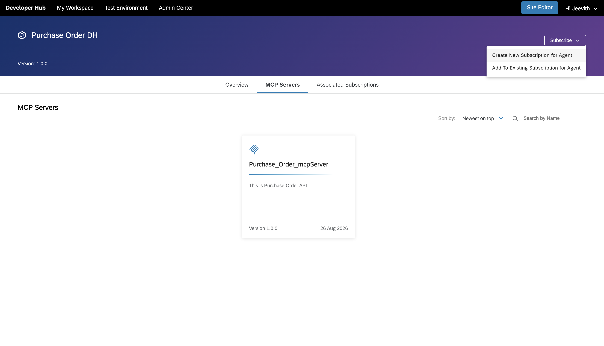
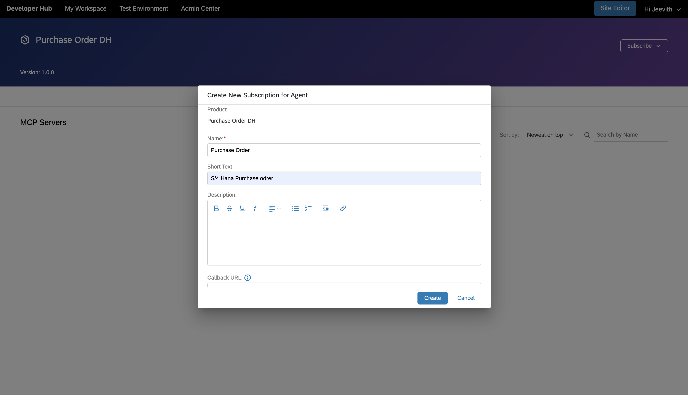

# 4. Subscribe via Developer Hub

AI agents connect to the MCP Server through a **subscription** created in the Developer Hub. The subscription provides the credentials (Token URL, Key, Secret) the agent uses to authenticate.

## 4.1 Find the Product

1. In the Developer Hub, navigate to the **Home** page.

2. Locate your published product and click on it.
3. Go to the **MCP Servers** tab to see the MCP Server inside the product.

---

## 4.2 Create an Agent Subscription

1. Click **Subscribe** on the MCP Server card.
2. Select **Create New Subscription for Agent**.

3. Enter a name and short description of your choice for the subscription.
4. Click **Create**.

---

## 4.3 Get the Credentials

To view the credentials for your new subscription:

1. Click the **Developer Hub** logo to go back to the home page.
2. Find and click your product.
3. Click **Associated Subscriptions**.
4. Click your subscription name to open it.

The subscription detail page shows the generated credentials:

| Credential | Description |
|---|---|
| **Token URL** | OAuth2 token endpoint the AI agent calls to get an access token |
| **Key** | Client ID |
| **Secret** | Client Secret |

> **Security:** Keep the Key and Secret confidential. Never commit them to a repository.

---

## Using the credentials with an AI client

Configure your MCP-compatible AI client (Claude Desktop, Joule Work Desktop, Cursor, etc.) using:

- **MCP Server URL:** the MCP URL from the MCP Server artifact in Integration Suite
- **Authentication:** OAuth2 with the Token URL, Key, and Secret from the subscription

---

## Summary

- [ ] Product found in Developer Hub catalog
- [ ] New agent subscription created
- [ ] Token URL, Key, and Secret captured
- [ ] AI client configured with MCP URL and credentials
- [ ] AI client can list and invoke MCP tools
