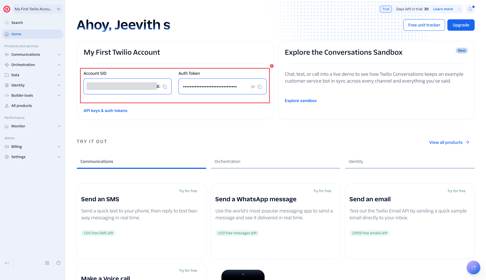
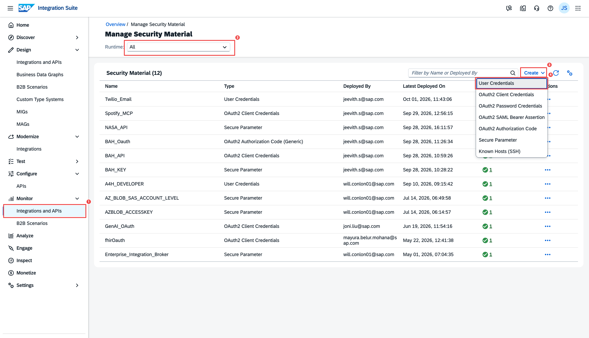
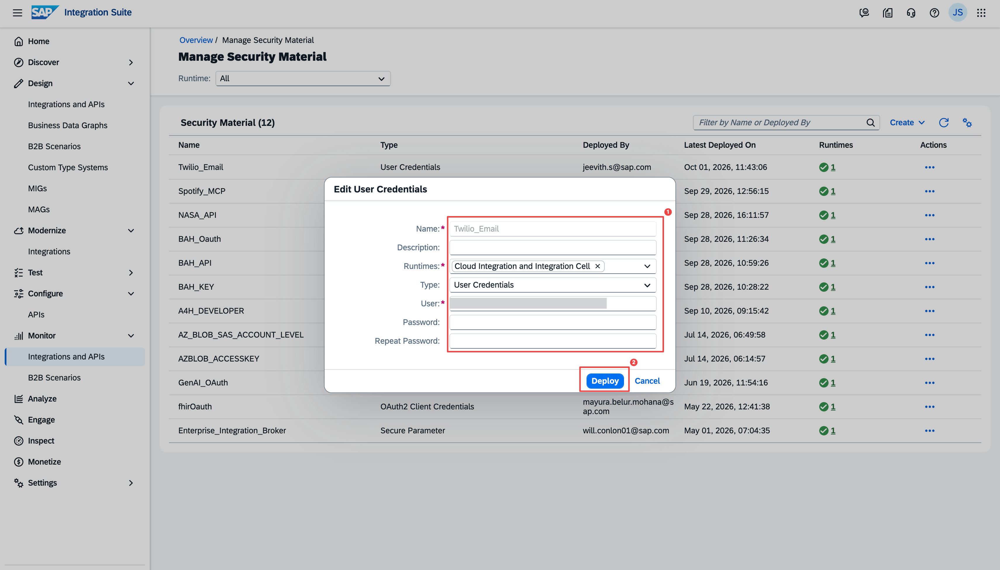
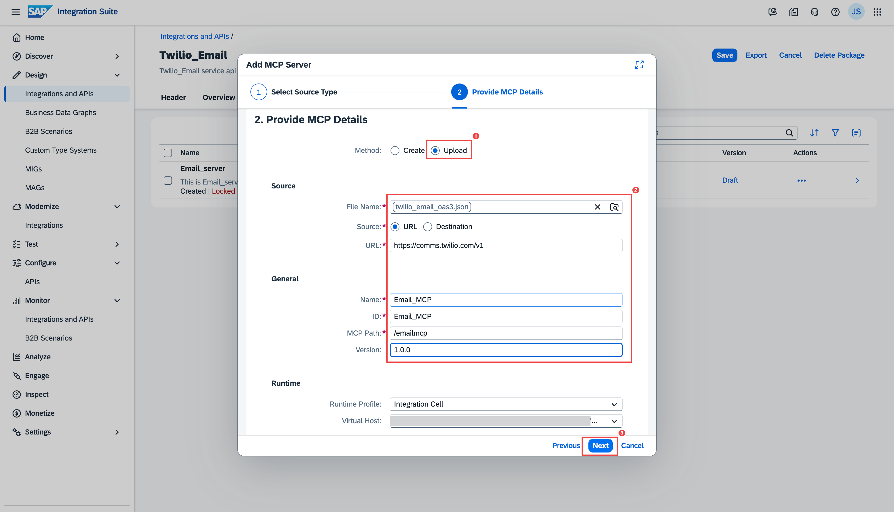
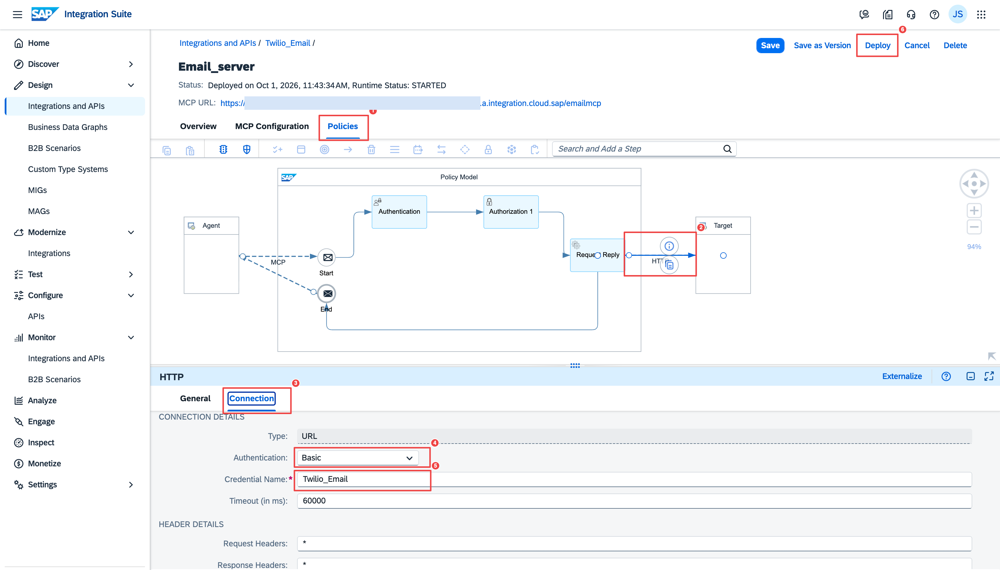

# 4. Twilio Email MCP Server

The Twilio Email MCP Server follows the same **external spec pattern** as Section 3 (Spotify) — no API artifact, manual Policies configuration. The difference is the authentication type: instead of OAuth2, Twilio uses **HTTP Basic Auth** (Account SID as username, Auth Token as password).

**What you will build:**

```
AI Client  ──MCP──▶  SAP IS MCP Server  ──Basic Auth──▶  Twilio Comms API
```

---

## What You Need

- A [Twilio account](https://www.twilio.com/try-twilio) — the free trial tier is sufficient
- From the [Twilio Console](https://console.twilio.com/) dashboard, note your:
    - **Account SID** (starts with `AC...`)
    - **Auth Token**
- For the trial tier, every **recipient email address** must be verified in the Twilio Console before emails can be delivered to it. Add your test email at: **Console → Email → Verified Sender Identities**



---

## Step 1 — Download the OpenAPI Spec

The Twilio Email API does not have a publicly published OpenAPI spec, so we provide one here built from the working API:

[Download twilio_email_oas3.json](downloads/twilio_email_oas3.json){ .md-button download="twilio_email_oas3.json" }

This spec exposes two tools:

| Tool | What it does |
|---|---|
| `post_Emails` | Send a transactional email |
| `get_Emails_Operations_operationId` | Check the delivery status of a sent email |

---

## Step 2 — Create a Security Material (User Credentials)

**Why this step:** SAP IS stores your Twilio **Account SID** (the username) and **Auth Token** (the password) as a **User Credentials** security material. The gateway attaches them as the HTTP Basic auth header on every outbound call to Twilio — so the AI client never handles the Twilio secret.

1. In Integration Suite, go to **Monitor → Security Materials**
2. Change the runtime filter from **Cloud Integration** to **All** — so the Integration Cell credential type is offered
3. Click **Create** and choose **User Credentials**



4. Fill in the form:

    | Field | Value |
    |---|---|
    | Name | `Twilio_Email` |
    | Description | Optional |
    | Runtimes | Select your Integration Cell runtime |
    | User | *Your Twilio Account SID* (e.g. `ACxxxxxxxxxxxxxxxxxxxxxxxxxxxxxxxx`) |
    | Password | *Your Twilio Auth Token* |



5. Click **Deploy**

---

## Step 3 — Create the MCP Server Artifact

**Why this step:** This creates the endpoint the AI client connects to. Each operation you select from the spec becomes an MCP tool the agent can call — here, "send an email" and "check delivery status".

1. Go to **Design → Integrations and APIs** → open your package → **Edit** → **Add → MCP Server**
2. **Step 1 — Source Type:** Choose **HTTP Endpoint with OpenAPI Specification** → **Next**
3. **Step 2 — Provide MCP Details:**
    - Upload `twilio_email_oas3.json`

    | Field | Value |
    |---|---|
    | Name | `Email_MCP` |
    | MCP Path | `/emailmcp` |
    | Version | `1.0.0` |
    | Runtime Profile | `Integration Cell` |



4. **Step 3 — Tool Selection:** Select both tools: `post_Emails` and `get_Emails_Operations_operationId`
5. Click **Add**

---

## Step 4 — Configure the Policies Tab *(required)*

!!! danger "Same requirement as Spotify — do not skip"
    Skipping this step causes all tool calls to return `Error occurred while fetching egress connection details`.

**What this does:** The Connection tab binds the `Twilio_Email` Security Material to the server's outbound call, so the gateway adds the Basic auth header automatically on every request to Twilio.

1. Open the **Email_MCP** artifact → **Policies** tab → **Edit**
2. Click the **HTTP** step → **Connection** tab
3. Configure:

    | Field | Value |
    |---|---|
    | Type | `URL` |
    | Authentication | `Basic` |
    | Credential Name | `Twilio_Email` |
    | Timeout (ms) | `60000` |



4. Click **Save**

---

## Step 5 — Deploy → Developer Hub → Subscribe

Follow [Section 1, Parts G–I](01-purchase-order-mcp.md#part-g-deploy-the-mcp-server):

- Add the `uaa.resource` scope on the MCP Server's **Authorization → Policy Setting → Scope** (same as [Section 1, Part F](01-purchase-order-mcp.md#part-f-add-the-mcp-server-artifact)), so the tokens Developer Hub issues are accepted
- Deploy → **STARTED**
- Publish a product in Developer Hub
- Create an agent subscription
- Save **Token URL**, **Key**, and **Secret**

---

## Calling `post_Emails` — The `requestBody` Wrapper

When an AI agent (or your own client) calls `post_Emails`, the arguments must be wrapped in a `requestBody` key. This is how SAP IS MCP Gateway represents the HTTP request body for POST operations:

```json
{
  "requestBody": {
    "from": {
      "address": "YOURSID@twilio.email",
      "name": "Your App Name"
    },
    "to": [
      { "address": "recipient@example.com" }
    ],
    "content": {
      "subject": "Your Order Has Been Confirmed",
      "html": "<p>Thank you for your order!</p>"
    }
  }
}
```

!!! note "Trial account sender address"
    On a Twilio trial account, the `from.address` must follow the format `YOURSID@twilio.email` where `YOURSID` is your Account SID.

!!! warning "Recipient must be verified (trial accounts)"
    Trial accounts can only deliver to email addresses that have been verified in the Twilio Console. If you send to an unverified address, Twilio returns:
    ```
    "The recipient email address is not verified for this trial account."
    ```
    This is a Twilio trial restriction, not a configuration error.

!!! danger "Trial accounts reject free-form HTML — approved template required"
    Even with a verified recipient and a valid payload, a **Twilio trial account** rejects free-form email content with:
    ```
    HTTP 400 — "Invalid template: email content does not match any approved template"
    ```
    This is an **account-level trial restriction**, *not* a SAP IS or MCP misconfiguration — the exact same payload fails identically whether sent through the MCP Server or with a direct `curl` to Twilio. To actually deliver free-form HTML you must either **upgrade the Twilio account** (removes the template restriction) or **create and use an approved template** on the account. The MCP Server, Security Material, and Policies are all working correctly when you see this error.

---

## Checklist

- [ ] Twilio account created; Account SID and Auth Token noted
- [ ] `twilio_email_oas3.json` downloaded
- [ ] `Twilio_Email` User Credentials security material deployed
- [ ] MCP Server artifact created with both email tools selected
- [ ] Policies HTTP Connection tab configured: Basic Auth → `Twilio_Email`
- [ ] MCP Server deployed (STARTED)
- [ ] Product published and agent subscription created
- [ ] Credentials saved

Next: [AI Agent Client →](05-ai-agent.md)
