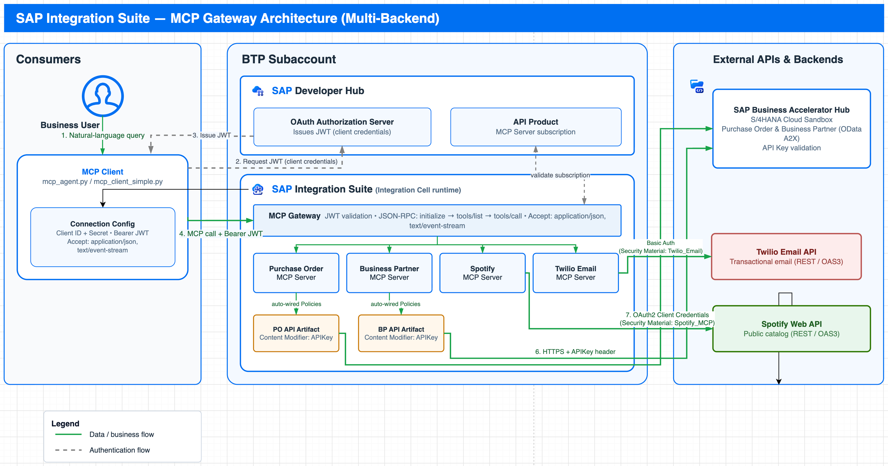

# Building an MCP Server with SAP Integration Suite

> Turn your enterprise APIs into AI-ready tools — governed, secured, and built on SAP.

---

## The Problem

Your business runs on APIs — purchase orders in SAP, customers in a CRM, notifications through an email service. AI agents are powerful, but wiring them directly into these systems means handing over credentials, losing audit control, and rebuilding the plumbing for every new tool.

**Model Context Protocol (MCP)** is the standard way for an AI agent to discover and call tools. When those tools run on **SAP Integration Suite**, every call is authenticated, logged, and policy-controlled — and the AI never sees a single backend password.

## A Real Scenario

Maya manages supply chain operations. When her CEO asks *"Which key suppliers have open orders, and have we followed up?"*, she normally spends 40 minutes across three systems — cross-referencing data and drafting emails by hand.

With an MCP-powered agent she asks once. The agent pulls the open purchase orders, matches them to supplier contacts, and sends the notifications — in seconds, fully governed by SAP. **This workshop teaches you to build exactly that.**

---

## Architecture

The AI client authenticates once through **Developer Hub** (OAuth2 client credentials), then every tool call flows through the **SAP IS MCP Gateway**, which validates the token and routes to the right backend — the BAH APIs via their API artifacts (API key injected server-side), Spotify via OAuth2 client credentials, and Twilio via Basic auth. The client never holds a single backend secret.

---

## What You Will Build

By the end of this workshop you will have four live MCP Servers — each exposing a different backend as AI-callable tools:

| # | MCP Server | Backend | What the AI can do |
|---|---|---|---|
| 1 | **Purchase Order** | SAP (OData) | List open POs, get PO details, check line items |
| 2 | **Business Partner** | SAP CRM | Look up customers, get contacts, create partners |
| 3 | **Spotify** | Spotify Web API | Search music catalog, get albums, artists, shows |
| 4 | **Twilio Email** | Twilio Comms API | Send transactional emails programmatically |

You will also connect an AI client that talks to all four servers simultaneously — either with an LLM reasoning engine, or a simple menu-driven client that needs no AI API key.

---

## Tutorial Steps

| | Step | What happens |
|---|---|---|
| 0 | [Prerequisites](00-prerequisites.md) | Confirm your environment is ready |
| 1 | [Purchase Order MCP](01-purchase-order-mcp.md) | Full end-to-end: API artifact, MCP Server, Developer Hub, subscribe, test |
| 2 | [Business Partner MCP](02-business-partner-mcp.md) | Same pattern, different API — abbreviated guide |
| 3 | [Spotify MCP](03-spotify-mcp.md) | External spec, OAuth2 client credentials — new Policies config pattern |
| 4 | [Twilio Email MCP](04-twilio-mcp.md) | External spec, Basic Auth — send emails from an AI agent |
| 5 | [AI Agent Client](05-ai-agent.md) | Connect all 4 servers to an AI client and run the full scenario |
| 6 | [Progress Checklist](06-checklist.md) | Track your completion |
| 7 | [Why This Matters](07-why-this-matters.md) | The big picture: what you built and why it changes AI-to-enterprise integration |

**Estimated time:** 2–3 hours end-to-end.

---

## Before You Start

You need:

- An **SAP BTP Trial account** — [Create one here](https://developers.sap.com/tutorials/hcp-create-trial-account/)
- **SAP Integration Suite** subscribed and activated on your BTP account — [Set it up here](https://developers.sap.com/tutorials/cp-starter-isuite-onboard-subscribe)
- Python 3.8+ installed locally (for the AI client section)

> **Security:** Never commit credentials, API keys, bearer tokens, or `mcp.json` files containing real secrets to GitHub.
